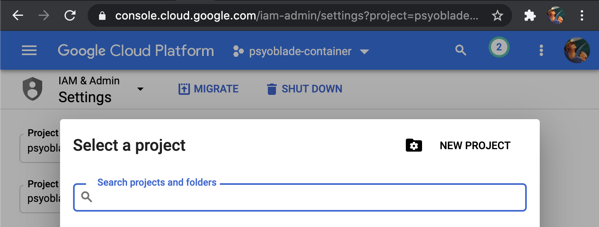
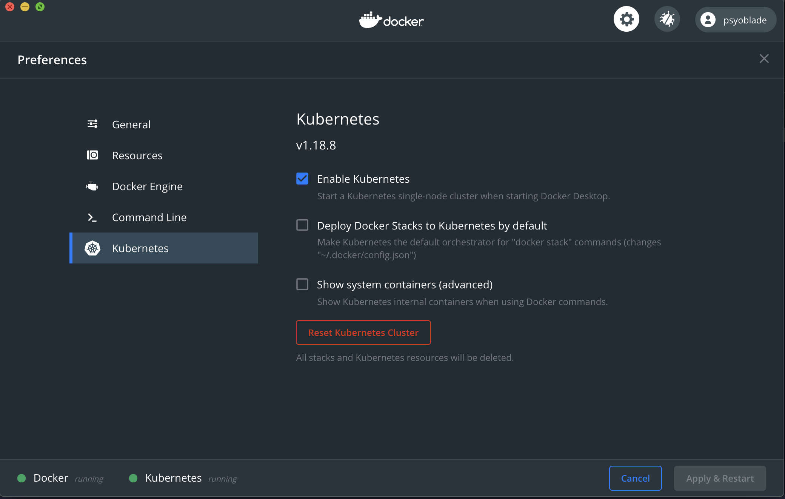

# 쿠버네티스 인 액션 1장

## 참고자료
* [Docker 의 작동원리](https://tech.ssut.me/what-even-is-a-container/)
* [Cgroups](https://wiki.archlinux.org/index.php/cgroups)


## 1. GKE 환경 구성
* [Google Cloud 무료 크레딧](https://cloud.google.com/free/docs/gcp-free-tier?hl=ko) 활용하기 위해 [Google Account](https://accounts.google.com) 신규 계정을 생성 합니다
* [Google Cloud Console](https://console.cloud.google.com/)에 로그인하여 신규 프로젝트를 생성합니다
  - 
  - "Project name", "Project ID" 값을 기억해 두었다가 터미널에서 사용합니다. 참고로 ID 의 경우 뒤에 6자리 숫자가 붙습니다
* [Kubernetes Engine](https://console.cloud.google.com/kubernetes/) 섹션으로 이동하여 신규 클러스터를 생성합니다
  - Region: asia-northeast3, Zone: asia-northeast3-a 로 지정하고 나머지는 default 설정으로 생성합니다
  - 기본 클러스터는 마스터 1개로 구성되어 노드가 없기 때문에 "ADD NODE POOL" 설정으로 노드를 추가 합니다 (default 설정, 3개 노드)
* [Google Cloud SDK](https://cloud.google.com/sdk/docs/quickstart) 설치
  - init 과정에서 클러스터 생성시에 작성했던 region, zone 및 project 정보를 입력합니다
  - config list 명령을 통해서 현재 설정을 확인할 수 있습니다
```bash
bash> gcloud config list
[compute]
region = asia-northeast3
zone = asia-northeast3-a
[core]
account = ******@gmail.com
disable_usage_reporting = True
project = psyoblade-container-******
```
* [Kubernetes Package Install](https://kubernetes.io/docs/tasks/tools/install-kubectl/) 사이트를 통해 설치할 수도 있습니다
  - 저는 Docker 설정을 통해 설치하였습니다
  - 
* 지금 부터는 로컬 환경에서 GKE 구성 및 수행이 가능합니다
  - 로컬에 이미 minikube 와 같은 설정이 있다면 컨텍스트 전환을 통해 변경이 가능합니다
```bash
bash> kubectl config get-contexts
CURRENT   NAME             CLUSTER                AUTHINFO                                NAMESPACE
          docker-desktop   docker-desktop         docker-desktop
*         gke_psyoblade-container-284316_******   gke_psyoblade-container-284316_******   gke_psyoblade-container-284316_******
          minikube         minikube               minikube
```


## 2. 컨테이너 기술 실습

### 2.1 실습을 위한 가상머신을 하나 생성합니다
> 클라이언트 환경이 리눅스가 아니라면 클라우드의 가상머신을 활용하여 실습합니다
* [Google Compute Engine](https://console.cloud.google.com/compute)을 통해 가장 작은 Ubuntu e2-micro 인스턴스를 하나 생성합니다
* [VPC Network - Firewall](https://console.cloud.google.com/networking/firewalls/) 설정에서 "default-allow-ssh" 확인합니다
  - 기본 설정으로 구성하면 방화벽은 (default-ssh allow) 설정으로 잡혔습니다
* [Connecting to instances](https://cloud.google.com/compute/docs/instances/connecting-to-instance) 명령으로 접속합니다
  - 처음 접속시에 public key 생성 및 교환을 수행합니다
```bash
bash> gcloud compute ssh --project <projectl-id> --zone <zone> <vm-name>
```

### 2.2 네임스페이스 명령어를 실습합니다
> 리눅스 커널에는 프로세스 별로 독립적인 공간을 제공하는 기능이 namespace 인데 이는 다음 6가지로 구분되어 제공됩니다
* [리눅스 네임스페이스](https://en.wikipedia.org/wiki/Linux_namespaces)는 우분투 18.04 LTS 버전에서는 7개의 네임스페이스를 제공하고 있습니다
  - mnt : 호스트 파일시스템에 구애받지 않고 독립적인 파일 시스템을 마운트, 언마운트 할 수 있습니다
  - pid : 독립적인 프로세스 공간을 할당 (첫 번째 프로세스 ID 가 1번이며, PID 1 이 종료되면 모든 하위 프로세스가 즉시 종료됩니다)
  - net : 독립적인 네트워크 공간으로, 네임스페이스 간에 포트 중복 등을 방지하며, 라우팅 테이블, 소켓, 방화벽 등의 리소스를 포함합니다
  - ipc : 프로세스간의 독립적인 통신통로를 할당하며, SystemV 타입의 프로세스간의 통신을 말합니다
  - uts : 독립적인 호스트 이름을 통해 서로 다른 호스트 및 도메인을 갖는 것처럼 보입니다 (UNIX 시간은 공유)
  - user : 독립적인 사용자를 할당하고, 권한 격리와 사용자 식별 분리를 제공합니다 (Linux 3.8)
  - cgroup : 컨트롤 그룹의 식별을 숨기는 네임스페이스입니다 (Linux 4.6 - March 2016)
  - time : 다른 시스템의 시간을 확인할 수 있습니다 (Linux 5.6 - March 2020)
* 네임스페이스를 확인합니다
```bash
bash> lsns
NS TYPE   NPROCS   PID USER      COMMAND
4026531835 cgroup      3  2287 psyoblade /lib/systemd/systemd --user
4026531836 pid         3  2287 psyoblade /lib/systemd/systemd --user
4026531837 user        3  2287 psyoblade /lib/systemd/systemd --user
4026531838 uts         3  2287 psyoblade /lib/systemd/systemd --user
4026531839 ipc         3  2287 psyoblade /lib/systemd/systemd --user
4026531840 mnt         3  2287 psyoblade /lib/systemd/systemd --user
4026531992 net         3  2287 psyoblade /lib/systemd/systemd --user
```
* 배시 스크립트를 격리된 환경에서 실행합니다
  - 각 옵션은 해당 네임스페이스 격리를 적용 합니다. 
  - --fork : unshare 의 자식 프로세스로 생성합니다
  - --pid : 프로세스를 격리된 상태로 생성합니다 (PID=1)
  - --mount-proc : /proc 경로를 파일 마운트 합니다
```bash
bash> sudo unshare --fork --pid --mount-proc bash
#> top
top - 14:44:12 up  2:54,  1 user,  load average: 0.00, 0.00, 0.00
Tasks:   2 total,   1 running,   1 sleeping,   0 stopped,   0 zombie
%Cpu(s):  0.0 us,  0.2 sy,  0.0 ni, 99.8 id,  0.0 wa,  0.0 hi,  0.0 si,  0.0 st
KiB Mem :  1003824 total,   176364 free,   270880 used,   556580 buff/cache
KiB Swap:        0 total,        0 free,        0 used.   600428 avail Mem

  PID USER      PR  NI    VIRT    RES    SHR S  %CPU %MEM     TIME+ COMMAND
    1 root      20   0   23004   4768   3344 S   0.0  0.5   0:00.02 bash
   11 root      20   0   42124   3588   3100 R   0.0  0.4   0:00.00 top
```
* 격리된 프로세스를 호스트에서 확인
  - 격리된 프로세스를 띄워둔 상태에서 별도의 터미널로 접속하여 top 프로세스를 확인합니다
  - 이로써 namespace 를 통해서 호스트의 공간을 **조금 더 격리된 혹은 제한된 공간**을 할당해주는 것임을 알 수 있습니다
```bash
bash> ps aux | grep top
root     13018  0.0  0.3  42124  3696 pts/1    S+   14:46   0:00 top
psyobla+ 13032  0.0  0.0  14852   968 pts/0    S+   14:46   0:00 grep --color=auto top
```
* 격리된 공간에 접근하기 (nsenter: namespace enter)
  - --all 옵션으로 모든 네임스페임스를 포함
  - -t PID 옵션으로 해당 공간에 접근
  - docker exec 와 유사한 기능으로 동작합니다
```bash
bash> pid=`ps aux | grep top | grep -v grep | awk '{ print $2 }'`
bash> sudo nsenter -t $pid --all
#> top
top - 14:50:54 up  3:01,  2 users,  load average: 0.00, 0.00, 0.00
Tasks:   4 total,   1 running,   3 sleeping,   0 stopped,   0 zombie
%Cpu(s):  0.0 us,  0.0 sy,  0.0 ni,100.0 id,  0.0 wa,  0.0 hi,  0.0 si,  0.0 st
KiB Mem :  1003824 total,   153196 free,   278544 used,   572084 buff/cache
KiB Swap:        0 total,        0 free,        0 used.   592504 avail Mem

  PID USER      PR  NI    VIRT    RES    SHR S  %CPU %MEM     TIME+ COMMAND
    1 root      20   0   23004   5052   3492 S   0.0  0.5   0:00.02 bash
   12 root      20   0   42124   3696   3204 S   0.0  0.4   0:00.06 top
   28 root      20   0   23112   5116   3416 S   0.0  0.5   0:00.03 bash
   42 root      20   0   42128   3560   3088 R   0.0  0.4   0:00.00 top
```
> 이와 같이 namespace 를 통해 다양한 격리된 환경을 제공할 수 있으며 cgroup (컨트롤 그룹)을 통해서 리소스(CPU, Memory, Network 등)까지 제어할 수 있습니다

* 도커는 LXC, LibContainer, runC 등은 리눅스 커널 기술인 namespaces, cgroups 등을 표준으로 정의한 OCI (Open Container Initiative) 스펙을 구현한 구현체입니다
  - 1.8 이전 버전까지는 LXC (LinuX Container)를 통해 구현되었으나, libcontainer 를 거쳐 현재는 [runC](https://www.docker.com/blog/runc/)(libcontainer의 리패키징된 구현체)로 발전되었습니다

* 도커는 1.11 버전부터 Docker-Engine 과 Containerd 로 구분된 구조로 동작하고 있습니다
  - Docker-Engine : 이미지, 네트워크, 디스크의 관리를 하고 있으며
  - Containerd : OCI 구현체이며 (runC) 실제 Container 를 관리하는 Daemon 입니다
```bash
bash> ps -afx | vi -
10437 ?        Ssl    0:02 /usr/bin/containerd
12003 ?        Sl     0:00  \_ containerd-shim -namespace moby -workdir /var/lib/containerd/io.containerd.runtime.v1.linux/moby/b54ab1618c5b2eefc755820308c4a26da8e13781778ce10d41c2fb37dc609334 -address /run/containerd/containerd.sock -containerd-binary /usr/bin/containerd -runtime-root /var/run/docker/runtime-runc
12021 ?        Ss     0:00      \_ nginx: master process nginx -g daemon off;
12097 ?        S      0:00          \_ nginx: worker process
10664 ?        Ssl    0:05 /usr/bin/dockerd -H fd:// --containerd=/run/containerd/containerd.sock
```
* 위의 프로세스에서와 같이 dockerd 와 containerd 는 별도의 프로세스로 동작하며, containerd -> containerd-shim -> runc 를 통해 nginx 가 기동됨을 확인할 수 있습니다
