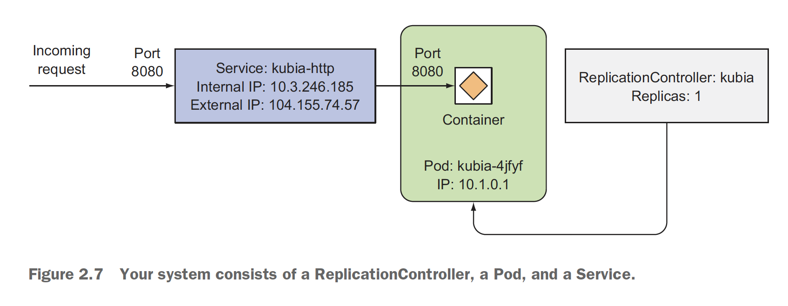
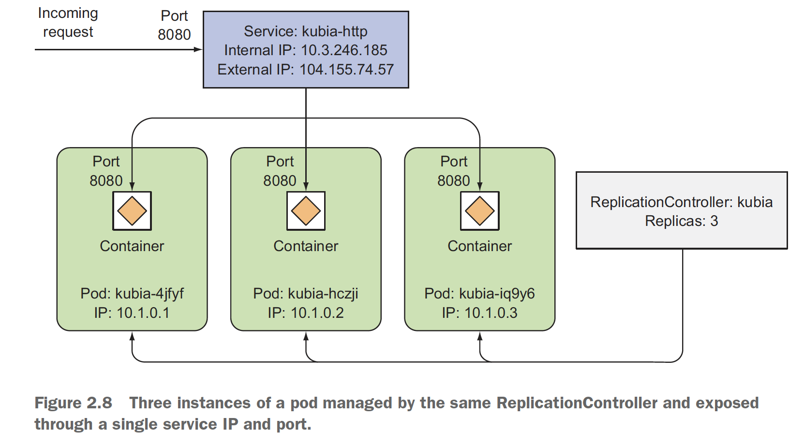

# 쿠버네티스 인 액션 2장


## 2.1 도커를 이용한 컨테이너 이미지 생성, 실행 및 공유

### 2.1.1 도커 설치와 Hello World 컨테이너 실행하기
```bash
bash> docker run --rm busybox echo "Hello world"
Hello world
```

### 2.1.2 간단한 node.js 애플리케이션 생성하기
* 노드 app.js 서버 및 Dockerfile 파일을 생성합니다
```bash
bash> cat kubia/node.js
const http = require('http');
const os = require('os');

console.log("Kubia server starting...");

var handler = function(request, response) {
  console.log("Received request from " + request.connection.remoteAddress);
  response.writeHead(200);
  response.end("You've hit " + os.hostname() + "\n");
};

var www = http.createServer(handler);
www.listen(8080);

bash> cat kubia/Dockerfile
FROM node:7
ADD app.js /app.js
ENTRYPOINT ["node", "app.js"]
```
* 로컬에서 이미지를 빌드하고 푸시합니다
  - [Create dockerhub Accesstoken](https://hub.docker.com/settings/security)
  - [Push & Check My Repository](https://hub.docker.com/u/suhyuk)
  - 맥 혹은 윈도우에서는 호스트에서는 해당 프로세스를 확인할 수 없습니다
```bash
bash> # 도커허브에 로그인 후, 이미지를 빌드합니다

bash> docker login --username suhyuk

bash> cd kubia

bash> docker build -t suhyuk/kubia .

bash> docker push suhyuk/kubia:latest

bash> docker images ls | grep kubia

bash> docker run --rm --name kubia-container -p 8080:8080 -d kubia

bash> curl -s http://localhost:8080

bash> docker ps

bash> docker exec -it kubia-container bash

bash> curl -s http://localhost:8080

bash> docker rm -f kubia-container
```


## 2.2 쿠버네티스 클러스터 설치

### 2.2.2 구글 쿠버네티스 엔진활용하여 Kubia 웹 서버 띄우기
> 초기 설정을 위한 실습을 수행합니다. 

* 실습을 위한 테스트 클러스터를 생성합니다
  - [Google Machien Types](https://cloud.google.com/compute/docs/machine-types) 를 참고하여 최적의 장비 유형을 선택합니다
  - f1-micro 타입이 가장 작지만 메모리가 작아서 실행이 안되므로 g1-small 을 선택합니다
```bash
bash> # gcloud container clusters create kubia --num-nodes 3 --machine-type f1-micro

bash> gcloud container clusters create kubia --num-nodes 3 --machine-type g1-small
kubeconfig entry generated for kubia.
NAME   LOCATION           MASTER_VERSION   MASTER_IP    MACHINE_TYPE  NODE_VERSION     NUM_NODES  STATUS
kubia  asia-northeast3-a  1.16.13-gke.401  34.64.73.56  g1-small      1.16.13-gke.401  3          RUNNING


bash> kubectl get nodes
NAME                                   STATUS   ROLES    AGE     VERSION
gke-kubia-default-pool-adab5992-fg67   Ready    <none>   5m30s   v1.16.13-gke.401
gke-kubia-default-pool-adab5992-k1fx   Ready    <none>   5m29s   v1.16.13-gke.401
gke-kubia-default-pool-adab5992-wndn   Ready    <none>   5m29s   v1.16.13-gke.401


bash> gcloud compute ssh gke-kubia-default-pool-adab5992-fg67 # 명령으로 SSH 접속이 가능합니다


bash> kubectl describe node gke-kubia-default-pool-adab5992-fg67
...
Events:
  Type     Reason                   Age                    From                                                   Message
  ----     ------                   ----                   ----                                                   -------
  Normal   Starting                 8m38s                  kubelet, gke-kubia-default-pool-adab5992-fg67          Starting kubelet.
  Normal   NodeHasSufficientMemory  8m38s (x2 over 8m38s)  kubelet, gke-kubia-default-pool-adab5992-fg67          Node gke-kubia-default-pool-adab5992-fg67 status is now: NodeHasSufficientMemory
  Normal   NodeHasNoDiskPressure    8m38s (x2 over 8m38s)  kubelet, gke-kubia-default-pool-adab5992-fg67          Node gke-kubia-default-pool-adab5992-fg67 status is now: NodeHasNoDiskPressure
  Normal   NodeHasSufficientPID     8m38s (x2 over 8m38s)  kubelet, gke-kubia-default-pool-adab5992-fg67          Node gke-kubia-default-pool-adab5992-fg67 status is now: NodeHasSufficientPID
  Normal   NodeAllocatableEnforced  8m38s                  kubelet, gke-kubia-default-pool-adab5992-fg67          Updated Node Allocatable limit across pods
  Normal   NodeReady                8m38s                  kubelet, gke-kubia-default-pool-adab5992-fg67          Node gke-kubia-default-pool-adab5992-fg67 status is now: NodeReady
  Warning  ContainerdStart          8m37s                  systemd-monitor, gke-kubia-default-pool-adab5992-fg67  Starting containerd container runtime...
  Warning  DockerStart              8m37s (x2 over 8m37s)  systemd-monitor, gke-kubia-default-pool-adab5992-fg67  Starting Docker Application Container Engine...
  Warning  KubeletStart             8m37s (x5 over 8m37s)  systemd-monitor, gke-kubia-default-pool-adab5992-fg67  Started Kubernetes kubelet.
  Normal   Starting                 8m35s                  kube-proxy, gke-kubia-default-pool-adab5992-fg67       Starting kube-proxy.

```

### 2.2.3 kubectl alias 와 auto-completion
* 아래와 같이 Oh-my-zsh 과 kubectl 조합으로 자동완성이 가능합니다
```bash
bash> cat ~/.zshrc
...
export KUBE_EDITOR=/usr/bin/vim
fpath=(~/.zsh/completion $fpath)
autoload -Uz compinit && compinit -i
alias k="kubectl"
complete -F __start_kubectl k
plugins=(git git-flow brew history node npm kubectl)
source <(kubectl completion zsh)
```


## 2.3 쿠버네티스 첫 번째 애플리케이션 띄우기

### 2.3.1 Node.js 띄우기
* 레플리케이션 컨트롤러를 정의해서 수행도 가능하지만, 약식으로 커맨드라인 실행은 아래와 같이 --generator 를 이용할 수 있습니다"
  - [Generators Deprecated](https://v1-17.docs.kubernetes.io/docs/reference/kubectl/conventions/#generators) 페이지를 보면 Pod 를 제외한 모든 Generator 는 Deprecated 되었고 아래의 명령은 Pod 만 생성됩니다
  - 별도로 생성된 kubia.yaml 을 통해서 ReplicationController 를 생성해 주어야만 다음 예제 실행이 가능합니다
```bash
bash> kubectl run kubia --image=suhyuk/kubia --port=8080 --generator=run/v1

bash> kubectl describe rc kubia
Flag --generator has been deprecated, has no effect and will be removed in the future.
pod/kubia created

bash> kubectl create -f kubia.yaml
```

### 2.3.2 외부 접근을 위한 로드밸런서 띄우기
* 개별 파드는 IP를 가지지만 컨테이너 내부에서만 사용되며, 외부 접속을 위해서는 반드시 LoadBalancer 유형의 서비스가 필요합니다
  - 단, minikube 혹은 kubeadm 의 경우 Custom Kubernetes Cluster 가 아니므로 NodePort 나 Ingress Controller 를 써야합니다.
  - [minikube 환경에서 tunnel 을 통한 localhost 수행](https://stackoverflow.com/questions/44110876/kubernetes-service-external-ip-pending)
  - ReplicationController 를 LoadBalancer 를 통해서 외부 노출시키는 명령어
```bash
bash> kubectl expose rc kubia --type=LoadBalancer --name kubia-http
service/kubia-http exposed


bash> kubectl get services
NAME         TYPE           CLUSTER-IP      EXTERNAL-IP   PORT(S)          AGE
kubernetes   ClusterIP      10.87.240.1     <none>        443/TCP          49m
kubia-http   LoadBalancer   10.87.245.214   <pending>     8080:31973/TCP   26s

bash> curl -s http://34.64.78.247:8080/
You've hit kubia
```
* 리플리케이션 컨트롤러, 파드, 서비스가 동작하는 방식 이해
  - 외부 요청을 서비스(LB)가 받아서 리플리케이션 컨트롤러에 의해 관리되는 파드로 전달합니다
  - 한 번 생성된 서비스는 label selector 를 통해서 일시적ephemeral 인 파드를 찾을 수 있습니다



### 2.3.4 레플리카 수 조정하기
* 임의의 레플리카 수를 적용하기
```bash
bash> kubectl scale rc kubia --replicas=3
NAME          READY   STATUS              RESTARTS   AGE
kubia         1/1     Running             0          27m
kubia-bxzh9   0/1     ContainerCreating   0          3s
kubia-kq65x   0/1     ContainerCreating   0          3s

bash> kubectl get rc
NAME    DESIRED   CURRENT   READY   AGE
kubia   3         3         3       24m

bash> kubectl get pods
NAME          READY   STATUS    RESTARTS   AGE
kubia         1/1     Running   0          28m
kubia-bxzh9   1/1     Running   0          46s
kubia-kq65x   1/1     Running   0          46s

```
* 모든 컨테이너가 호출을 받는지 확인해 봅니다
```bash
bash> extip=`k get svc | grep -i kubia-http | awk '{ print $4 }'`
bash> while true; do curl ${extip}:8080; sleep 1 ; done
You've hit kubia-kq65x
You've hit kubia-kq65x
You've hit kubia
You've hit kubia
You've hit kubia-bxzh9
You've hit kubia-kq65x

bash> kubectl describe pods kubia-kq65x
Events:
  Type    Reason     Age   From                                           Message
  ----    ------     ----  ----                                           -------
  Normal  Scheduled  4m7s  default-scheduler                              Successfully assigned default/kubia-kq65x to gke-kubia-default-pool-adab5992-wndn
  Normal  Pulling    4m6s  kubelet, gke-kubia-default-pool-adab5992-wndn  Pulling image "suhyuk/kubia:latest"
  Normal  Pulled     4m3s  kubelet, gke-kubia-default-pool-adab5992-wndn  Successfully pulled image "suhyuk/kubia:latest"
  Normal  Created    4m3s  kubelet, gke-kubia-default-pool-adab5992-wndn  Created container kubia
  Normal  Started    4m3s  kubelet, gke-kubia-default-pool-adab5992-wndn  Started container kubia
```
* 복제수가 3개로 늘어난 상태



### 2.3.5 애플리케이션 실행 중인 노드 검사하기

```bash
bash> kubectl describe pods kubia

bash> kubectl get pods -o wide
NAME          READY   STATUS    RESTARTS   AGE     IP          NODE                                   NOMINATED NODE   READINESS GATES
kubia         1/1     Running   0          36m     10.84.0.8   gke-kubia-default-pool-adab5992-fg67   <none>           <none>
kubia-bxzh9   1/1     Running   0          8m53s   10.84.2.5   gke-kubia-default-pool-adab5992-k1fx   <none>           <none>
kubia-kq65x   1/1     Running   0          8m53s   10.84.1.6   gke-kubia-default-pool-adab5992-wndn   <none>           <none>

```
* 대시보드를 통해 상태 확인하기
  - [Kubernetes Dashboard](http://localhost:60190/api/v1/namespaces/kubernetes-dashboard/services/http:kubernetes-dashboard:/proxy/#/overview?namespace=default)
```bash
bash> # minikube dashboard
bash> cloud container clusters list
```
*  모든 작업이 완료 되었다면 컨트롤러 및 파드 삭제하기
```
bash> kubectl delete -f kubia.yaml
replicationcontroller "kubia" deleted

bash> kubectl delete svc kubia-http
service "kubia-http" deleted

bash> gcloud container clusters delete kubia
```
