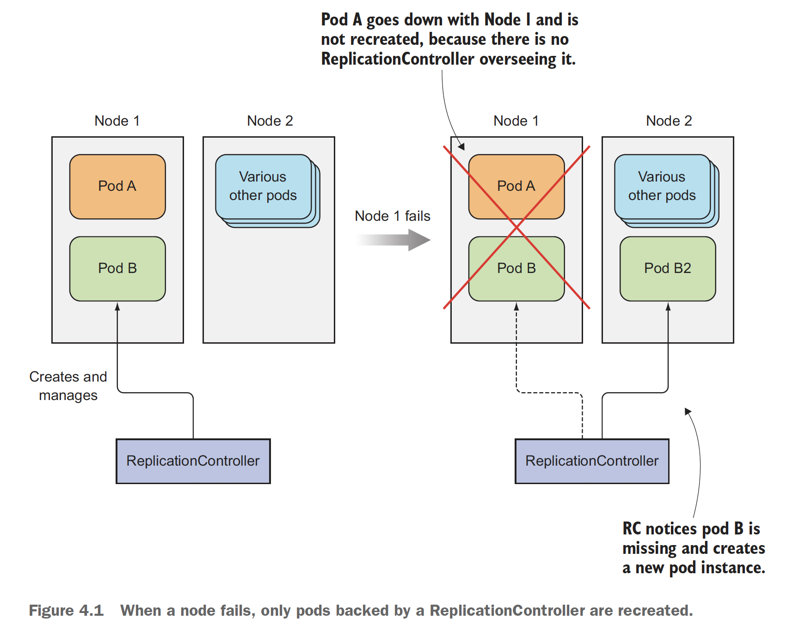
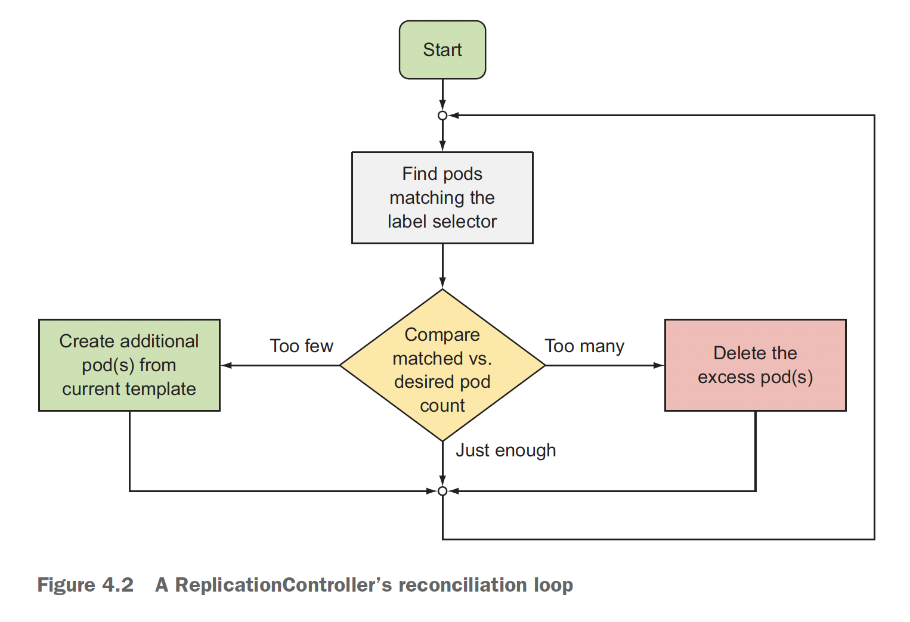
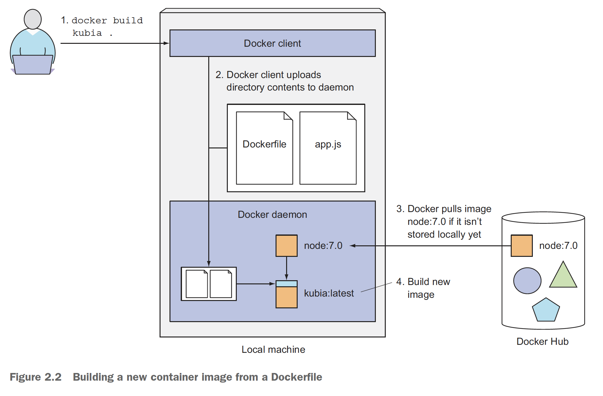
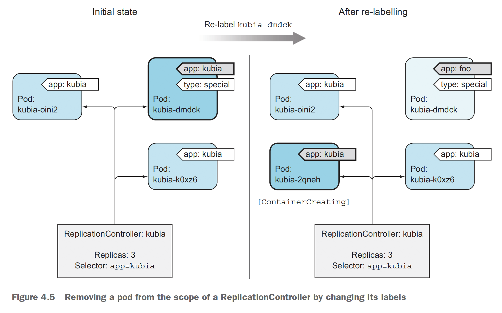
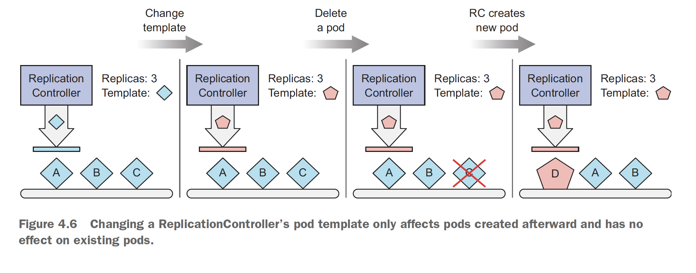
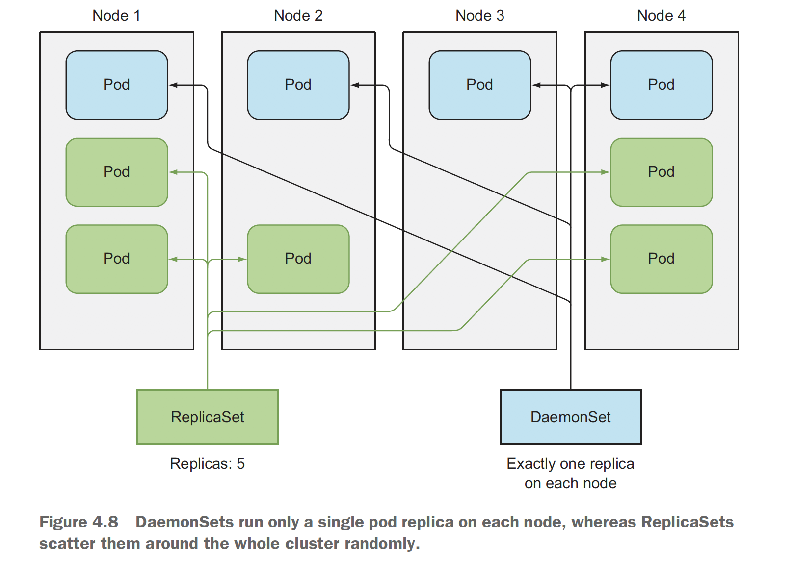
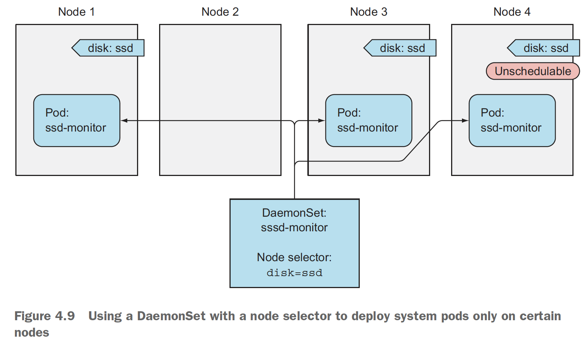
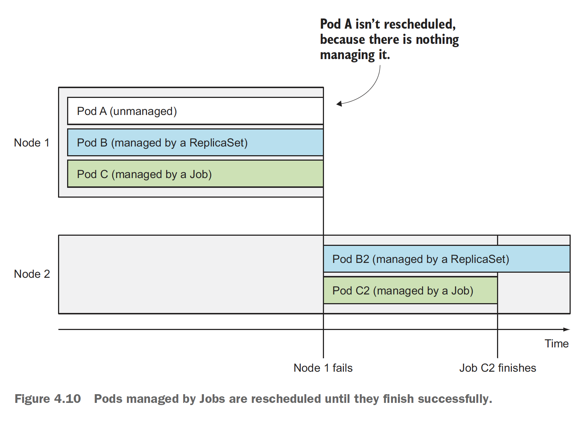

# 쿠버네티스 인 액션 4장

* 목차
```text
파드의 안정적인 유지
동일한 파드의 여러 인스턴스 실행
노드 장애 시 자동으로 파드 재스케줄링
파드의 수평 스케줄링
각 클러스터 노드에서 시스템 수준의 파드 실행
배치 잡 실행
잡을 주기적 또는 한 번만 실행하도록 스케줄링
```


## 4.1. 파드를 안정적으로 유지하기

### 4.1.1 라이브니스 프로브 소개
* Liveness Probe (죽었나 살았나?)
  - 컨테이너가 정상인지 여부를 파악하고, 비정상인 경우 다시 시작합니다.
  - 문제점이 발생한 컨테이너를 관리하는 역할
* Readiness Probe (준비 되었나?)
  - 파드가 서비스를 처리할 준비가 되어 있는지를 체크하고, 아직 준비되지 않았다면 로드밸런스에서 제외됩니다.
  - 서비스 제공을 하기 위한 준비가 될 때까지 기다리는 역할입니다.
* 세 가지 매커니즘 제공
  - HTTP GET : 응답 코드가 성공(2xx, 3xx)이면 정상이고, 실패(4xx, 5xx) 이면 컨테이너를 다시 시작합니다
  - TCP 소켓 : TCP 접속에 성공하면 성공, 아니면 실패로 간주
  - Exec 프로브 : 명령 실행의 상태 코드가 0이면 성공, 외에는 모두 실패로 간주

### 4.1.2 HTTP 기반 라이브니스 프로브 생성
* HTTP 기반의 Liveness Probe 를 생성합니다
```bash
bash> kubectl create -f kubia-liveness-probe.yaml
bash> kubectl get po
bash> kubectl describe po kubia-liveness

Events:
  Type     Reason     Age               From               Message
  ----     ------     ----              ----               -------
  Normal   Scheduled  8m4s              default-scheduler  Successfully assigned default/kubia-liveness to minikube
  Normal   Pulling    7m58s             kubelet, minikube  Pulling image "luksa/kubia-unhealthy"
  Normal   Pulled     82s               kubelet, minikube  Successfully pulled image "luksa/kubia-unhealthy"
  Normal   Created    81s               kubelet, minikube  Created container kubia
  Normal   Started    81s               kubelet, minikube  Started container kubia
  Warning  Unhealthy  1s (x3 over 21s)  kubelet, minikube  Liveness probe failed: HTTP probe failed with statuscode: 500
  Normal   Killing    1s                kubelet, minikube  Container kubia failed liveness probe, will be restarted

bash> k exec kubia-liveness -- curl -s localhost:8080  # 명령으로 주기적으로 확인합니다

```
* 주기적으로 계속 확인해 보면 Terminated 된 상태를 확인할 수 있습니다
  - "--previous" 옵션을 추가해 이전의 로그까지 logs 명령으로 학인할 수 있습니다
  - 종료 코드가 137번이며 = 128 + x 로써 SIGKILL (9) 으로 종료된 것을 확인할 수 있습니다
  - 128 숫자는 docker 종료 시에 반환하는 숫자라서 그 숫자와의 합으로 표현합니다 
```bash
kubectl describe po kubia-liveness
kubectl logs kubia-liveness --previous
...

Containers:
  kubia:
    Container ID:   docker://b2c2468cf860f1ad7696f7403a7ce80d46c0d946e06bf952f96c8c15507b6a04
    Image:          luksa/kubia-unhealthy
    Image ID:       docker-pullable://luksa/kubia-unhealthy@sha256:5c746a42612be61209417d913030d97555cff0b8225092908c57634ad7c235f7
    Port:           <none>
    Host Port:      <none>
    State:          Running
      Started:      Sat, 24 Oct 2020 00:11:33 +0900
    Last State:     Terminated
      Reason:       Error
      Exit Code:    137
      Started:      Sat, 24 Oct 2020 00:09:43 +0900
      Finished:     Sat, 24 Oct 2020 00:11:29 +0900
    Ready:          True
    Restart Count:  4
    Requests:
      cpu:        100m
    Liveness:     http-get http://:8080/ delay=0s timeout=1s period=10s #success=1 #failure=3
    Environment:  <none>
    Mounts:
      /var/run/secrets/kubernetes.io/serviceaccount from default-token-v7nd8 (ro)
...
Events:
  Type     Reason     Age                    From                                           Message
  ----     ------     ----                   ----                                           -------
  Normal   Scheduled  8m55s                  default-scheduler                              Successfully assigned default/kubia-liveness to gke-kubia-default-pool-ca08bdd4-b79f
  Normal   Created    4m46s (x3 over 8m23s)  kubelet, gke-kubia-default-pool-ca08bdd4-b79f  Created container kubia
  Normal   Started    4m46s (x3 over 8m23s)  kubelet, gke-kubia-default-pool-ca08bdd4-b79f  Started container kubia
  Warning  Unhealthy  3m30s (x9 over 7m30s)  kubelet, gke-kubia-default-pool-ca08bdd4-b79f  Liveness probe failed: HTTP probe failed with statuscode: 500
  Normal   Killing    3m30s (x3 over 7m10s)  kubelet, gke-kubia-default-pool-ca08bdd4-b79f  Container kubia failed liveness probe, will be restarted
  Normal   Pulling    3m (x4 over 8m54s)     kubelet, gke-kubia-default-pool-ca08bdd4-b79f  Pulling image "luksa/kubia-unhealthy"
  Normal   Pulled     2m56s (x4 over 8m26s)  kubelet, gke-kubia-default-pool-ca08bdd4-b79f  Successfully pulled image "luksa/kubia-unhealthy"

```
* [Configure Liveness, Readiness and Startup Probes](https://kubernetes.io/docs/tasks/configure-pod-container/configure-liveness-readiness-startup-probes/) - Liveness: http-get http://:8080/ delay=0s timeout=1s period=10s #success=1 #failure=3
  - delay : 지연 없이 컨테이너 시작 직후부터 체크 (initialDelaySeconds)
  - timeout : 1s 1초 이내에 컨테이너 응답이 필요 (timeoutSeconds)
  - period : 10초 마다 수행 (periodSeconds)
  - success : 1번 성공해야 성공이라고 판단 (successThreshold)
  - failure : 3번 실패시에 컨테이너 재시작 (failureThreshold)
  
* 초기에 지연시간을 주기 위해 initialDelaySeconds 값을 지정할 수 있습니다
  - 이는 기동 시에 오래 걸리는 애플리케이션의 경우 liveness 지연 시간을 주지 않는 경우 위와 같은 원인으로 파드가 종료될 수 있습니다
  - **운영 중인 파드는 반드시 라이브니스 프로브를 정의**해야만 쿠버네티스가 애플리케이션이 살아있음을 알 수 있습니다
  - 더 나은 라이브니스 프로브를 위해서 **특정 URL (/health) 를 구성하는 것**이 유용하며, 반드시 엔드포인트 인증 필요여부를 체크합니다
  - 애플리케이션 내부만 체크해야지, **외부 의존 서비스에 대한 문제를 해당 애플리케이션에서 고려해서는 안된다 (데이터베이스 접근)**
  - 최대한 가볍게 1초 이내에 수행될 수 있도록 구성하며, **재시도하는 것은 의미가 없습**니다 (여러번 해도 쿠버네티스는 1번실패로 간주)
  - 라이브니스 프로브는 해당 쿠블렛 수준의 영역이므로, 애플리케이션이 다른 노드에 수행되도록 하는 것은 RC 등의 다른 메커니즘을 통해 파드를 관리해야 합니다
```bash
bash> kubectl create -f kubia-liveness-probe-with-options.yaml
```


## 4.2 레플리케이션 컨트롤러 소개
> 파드가 항상 실행됨을 보장하는 역할이 레플리케이션 컨트롤러입니다



### 4.2.1 레플리케이션 컨트롤러의 동작
> 노드 장애 시에 해당 노드에서 수행되던 파드 가운데 리플리케이션 컨트롤러에 의해 관리되는 경우에만 다른 노드에서 수행됩니다

* 레플리케이션컨트롤러의 3가지 요소
  - label selector : 라벨을 통해 관리 대상 파드를 선택
  - replica count : 파드의 레플리카 수
  - pod template : 새로운 파드 레플리카를 만들 때에 사용하는 붕어빵 틀



### 4.2.2 레플리케이션 컨트롤러 생성
> 레플리케이션 컨틀롤러 생성을 통해 파드까지 모두 생성됩니다
* 레플리케이션 생성 시에 파드 셀렉터를 지정하지 않으면 템플릿의 라벨을 사용하므로 조금 더 유연하다
```bash
bash> kubectl create -f kubia-rc.yaml
bash> kubectl create -f kubia-rc-without-selector.yaml
```
* 레플리케이션이 잘 관리되는지 일부 파드를 삭제합니다
  - 리플리케이션 컨트롤러의 상태도 같이 확인합니다
```bash
kubectl get po -l app=kubia
kubectl delete po kubia-7hjkc

NAME             READY   STATUS             RESTARTS   AGE
kubia-7hjkc      0/1     Terminating        0          5m8s
kubia-9w7gs      1/1     Running            0          34s
kubia-f4d5l      1/1     Running            0          5m8s
kubia-r9xtd      1/1     Running            0          5m8s

kubectl get rc
```

* 상세한 수행 내역은 describe 를 통해 확인합니다
  - 특정 파드가 삭제 혹은 종료가 새로운 파드의 생성을 트리거링 하는 것이 아닙니다.
  - 리플리케이션컨트롤러는 현재 상태의 비정상을 확인하고 파드의 상태를 유지하는 것입니다
```bash
kc describe rc kubia

Name:         kubia
Namespace:    default
Selector:     app=kubia
Labels:       app=kubia
Annotations:  <none>
Replicas:     3 current / 3 desired
Pods Status:  3 Running / 0 Waiting / 0 Succeeded / 0 Failed
Pod Template:
  Labels:  app=kubia
  Containers:
   kubia:
    Image:        luksa/kubia
    Port:         8080/TCP
    Host Port:    0/TCP
    Environment:  <none>
    Mounts:       <none>
  Volumes:        <none>
Events:
  Type    Reason            Age    From                    Message
  ----    ------            ----   ----                    -------
  Normal  SuccessfulCreate  6m37s  replication-controller  Created pod: kubia-r9xtd
  Normal  SuccessfulCreate  6m37s  replication-controller  Created pod: kubia-7hjkc
  Normal  SuccessfulCreate  6m37s  replication-controller  Created pod: kubia-f4d5l
  Normal  SuccessfulCreate  2m3s   replication-controller  Created pod: kubia-9w7gs
```


### 4.2.3 레플리케이션 컨트롤러 작동확인
> 로컬 Minikube 의 경우 하나의 노드만 존재하므로 노드 장애를 실습하기는 어렵습니다
* 구글 클라우드 명령(gcloud compute ssh)으로 특정 노드에 접속 후 네트워크 인터페이스를 종료(sudo ifconfig eth0 down)합니다
  - "-o wide" 옵션으로 파드를 조회해, 적어도 하나 이상 실행 중인 노드를 선택합니다
  - 네트워크 문제 뿐만 아니라 장비의 장애의 경우에도 유사하게 스스로 치유됩니다
```bash
bash> kubectl get po -o wide
NAME          READY   STATUS    RESTARTS   AGE     IP          NODE                                   NOMINATED NODE   READINESS GATES
kubia-8f6b5   1/1     Running   0          4m31s   10.84.0.7   gke-kubia-default-pool-ca08bdd4-3775   <none>           <none>
kubia-b26v6   1/1     Running   0          4m31s   10.84.1.8   gke-kubia-default-pool-ca08bdd4-b79f   <none>           <none>
kubia-w2sp2   1/1     Running   0          4m31s   10.84.2.6   gke-kubia-default-pool-ca08bdd4-fc0h   <none>           <none>

bash> gcloud compute ssh gke-kubia-default-pool-ca08bdd4-3775

$> sudo ifconfig eth0 down

bash> k get node
NAME                                   STATUS     ROLES    AGE   VERSION
gke-kubia-default-pool-ca08bdd4-3775   NotReady   <none>   80m   v1.16.13-gke.401
gke-kubia-default-pool-ca08bdd4-b79f   Ready      <none>   80m   v1.16.13-gke.401
gke-kubia-default-pool-ca08bdd4-fc0h   Ready      <none>   80m   v1.16.13-gke.401

bash> kubectl get pods
NAME          READY   STATUS    RESTARTS   AGE
kubia-8f6b5   1/1     Unknown   0          13m
kubia-b26v6   1/1     Running   0          13m
kubia-w2sp2   1/1     Running   0          13m
kubia-zpkgx   1/1     Running   0          74s

bash> gcloud compute instances reset gke-kubia-default-pool-ca08bdd4-3775 
Events:
  Type     Reason                   Age                From                                                   Message
  ----     ------                   ----               ----                                                   -------
  Warning  ContainerdStart          11s                systemd-monitor, gke-kubia-default-pool-ca08bdd4-3775  Starting containerd container runtime...
  Warning  DockerStart              11s (x2 over 11s)  systemd-monitor, gke-kubia-default-pool-ca08bdd4-3775  Starting Docker Application Container Engine...
  Warning  KubeletStart             11s                systemd-monitor, gke-kubia-default-pool-ca08bdd4-3775  Started Kubernetes kubelet.
  Normal   Starting                 11s                kubelet, gke-kubia-default-pool-ca08bdd4-3775          Starting kubelet.
  Normal   NodeHasSufficientMemory  10s (x2 over 10s)  kubelet, gke-kubia-default-pool-ca08bdd4-3775          Node gke-kubia-default-pool-ca08bdd4-3775 status is now: NodeHasSufficientMemory
  Normal   NodeHasNoDiskPressure    10s (x2 over 10s)  kubelet, gke-kubia-default-pool-ca08bdd4-3775          Node gke-kubia-default-pool-ca08bdd4-3775 status is now: NodeHasNoDiskPressure
  Normal   NodeHasSufficientPID     10s (x2 over 10s)  kubelet, gke-kubia-default-pool-ca08bdd4-3775          Node gke-kubia-default-pool-ca08bdd4-3775 status is now: NodeHasSufficientPID
  Warning  Rebooted                 10s                kubelet, gke-kubia-default-pool-ca08bdd4-3775          Node gke-kubia-default-pool-ca08bdd4-3775 has been rebooted, boot id: 3523510e-b1cd-4009-ad97-2910a125aef8
  Normal   NodeAllocatableEnforced  10s                kubelet, gke-kubia-default-pool-ca08bdd4-3775          Updated Node Allocatable limit across pods
  Normal   NodeReady                10s                kubelet, gke-kubia-default-pool-ca08bdd4-3775          Node gke-kubia-default-pool-ca08bdd4-3775 status is now: NodeReady
  Normal   Starting                 6s                 kube-proxy, gke-kubia-default-pool-ca08bdd4-3775       Starting kube-proxy.

bash> kubectl get pods
NAME                                   STATUS   ROLES    AGE   VERSION
gke-kubia-default-pool-ca08bdd4-3775   Ready    <none>   88m   v1.16.13-gke.401
gke-kubia-default-pool-ca08bdd4-b79f   Ready    <none>   88m   v1.16.13-gke.401
gke-kubia-default-pool-ca08bdd4-fc0h   Ready    <none>   88m   v1.16.13-gke.401
```
  - 의외로 파드가 재시작 되는 데에는 시간이 오래 걸렸습니다


### 4.2.4 레플리케이션 컨트롤러 범위 안팎으로 파드 이동하기 (featured by label)
* 파드의 레이블을 변경하는 경우 파드가 사라진 것으로 인지하고 레플리케이션컨트롤러는 레플리카 수를 유지하기 위해 파드를 생성
  - 레플리케이션컨트롤러의 레이블 셀렉터와 일치하지 않게 만들어야만 합니다
```bash
bash> kubectl get po --show-labels

bash> kubectl label po kubia-r9xtd type=special

bash> kubectl label po kubia-9w7gs app=foo --overwrite

bash> kubectl get po --show-labels

bash> kubectl get pods -L app
```


### 4.2.5 파드 템플릿 변경
> 템플릿을 edit 하더라도 기존 파드에는 영향이 없으며, 새로운 파드 생성 시에 적용됩니다
* 레플리케이션컨트롤러를 직접 편집기로 수정할 수 있습니다
  - 환경 변수에서 KUBE\_EDITOR 값으로 편집기 지정이 가능합니다
```bash

export KUBE_EDITOR = "/usr/bin/vim"

kubectl edit rc kubia
labels.app : kubia -> foo
spec.selector.pp : kubia -> foo

kubectl get po --show-labels
NAME          READY   STATUS    RESTARTS   AGE     LABELS
kubia-8zw5n   1/1     Running   0          62s     app=foo
kubia-9w7gs   1/1     Running   0          24m     app=foo
kubia-f4d5l   1/1     Running   0          28m     app=kubia
kubia-f8d86   1/1     Running   0          7m23s   app=kubia
kubia-mdj5s   1/1     Running   0          62s     app=foo
kubia-r9xtd   1/1     Running   0          28m     app=kubia,type=special
```
* 파드 셀렉터와 일치하지 않도록 라벨을 변경했을 때의 상황



## 4.2.6 수평 파드 스케줄링
* 레플리카수를 변경하는 것은 파드를 변경하는 것이 아니므로 쉽게 적용이 가능합니다
  - 마찬가지로 kubectl edit rc 명령을 통해서 선언적인 수정도 가능합니다
```bash
bash> kubectl scale rc kubia --replicas=4
bash> kubectl get pods -o wide
NAME          READY   STATUS    RESTARTS   AGE     IP          NODE                                   NOMINATED NODE   READINESS GATES
kubia-b26v6   1/1     Running   0          6h28m   10.84.1.8   gke-kubia-default-pool-ca08bdd4-b79f   <none>           <none>
kubia-jkgjb   1/1     Running   0          61s     10.84.0.8   gke-kubia-default-pool-ca08bdd4-3775   <none>           <none>
kubia-w2sp2   1/1     Running   0          6h28m   10.84.2.6   gke-kubia-default-pool-ca08bdd4-fc0h   <none>           <none>
kubia-zpkgx   1/1     Running   0          6h16m   10.84.1.9   gke-kubia-default-pool-ca08bdd4-b79f   <none>           <none>

bash> kubectl edit rc kubia
bash> k get po
NAME          READY   STATUS    RESTARTS   AGE
kubia-b26v6   1/1     Running   0          6h29m
kubia-gdtpr   1/1     Running   0          9s
kubia-jkgjb   1/1     Running   0          2m15s
kubia-w2sp2   1/1     Running   0          6h29m
kubia-zpkgx   1/1     Running   0          6h17m
```



### 4.2.7 레플리케이션 컨트롤러 삭제
* 레플리케이션 컨트롤러의 삭제 시에 포함된 모든 파드도 같이 삭제됩니다
  - "--cascade=false" 옵션을 통해서 파드는 살려둘 수도 있습니다
```bash
bash> kubectl delete rc kubia --cascade=false
bash> kubectl get po

NAME          READY   STATUS        RESTARTS   AGE
kubia-8zw5n   1/1     Terminating   0          6m56s
kubia-9w7gs   1/1     Terminating   0          30m
kubia-f4d5l   1/1     Running       0          34m
kubia-f8d86   1/1     Running       0          13m
kubia-mdj5s   1/1     Terminating   0          6m56s
kubia-r9xtd   1/1     Running       0          34m

bash> kubectl delete po --all
pod "kubia-b26v6" deleted
pod "kubia-m4lhv" deleted
pod "kubia-w2sp2" deleted
pod "kubia-zpkgx" deleted
```


## 4.3 레플리케이션 컨트롤러 대신 레플리카셋 사용하기

### 4.3.1 레플리카셋과 레플리케이션 컨트롤러 비교
> "레플리카셋"은 좀 더 풍부한 표현식의 파드 셀렉터를 가져서, rc 는 동시에 2개의 라벨의 파드를 매칭할 수 없으나, rs는 가능합니다.

### 4.3.2 레플리카셋 정의하기
* 레플리카셋을 통한 파드 생성
  - 책에서는 "apps/v1beta2"을 사용하고 있으나 2020년 현재 정식 릴리스가 되어 beta2 를 제거해야 정상 동작합니다
  - ReplicationController 의 경우 spec.selector.app : kubia 형식이지만,
  - ReplicaSet 의 경우 spec.selector.matchLabels.app : kubia 형식으로 지정하는 부분만 다릅니다
  - apiVersion 속성은 "apiGroup/apiVersion" 형식으로 지정할 수 있으며 여기서는 "apps/v1" 으로 정의되어 있습니다

### 4.3.3 레플리카셋 생성 및 검사
```bash
bash> kubectl create -f kubia-replicaset.yaml
bash> kubectl get rs
```

### 4.3.4 더욱 표현적인 레이블 셀렉터
* ReplicaSet 에서는 matchLabels 보다 더 강력한 matchExpressions 를 이용할 수 있습니다
  - In : 지정된 값 중 하나와 일치
  - NotIn : 지정된 값과 일치하지 않아야 함
  - Exists : 지정된 키를 가진 레이블이 포함되어야 한다 (값은 중요하지 않으며, 값 필드를 지정하지 않아야 한다)
  - DoesNotExist : 지정된 키를 가진 레이블이 포함되지 않아야 한다 (값 필드를 지정하지 않아야 한다)
```bash
bash> kubectl create -f kubia-replicaset-matchexpressions.yaml

bash> cat kubia-replicaset-matchexpressions.yaml
spec:
  replicas: 3
  selector:
    matchExpressions:
      - key: app
        operator: In
        values:
         - kubia

bash> kubectl delete rs kubia
```

## 4.4 데몬셋으로 모든 노드에 정확히 한 개의 파드 실행하기
> kube-proxy 와 같은 프로세스는 모든 노드에 반드시 하나만 존재하며, 이를 관리해주는데 이럴 때에 사용하는 것이 데몬셋입니다
* 레플리카셋은 클러스터 전체에 무작위로 파드를 분산시키지만, 데몬셋은 노드 당 하나씩만 유지합니다
  - 일반적으로 systemd 를 통해 데몬을 운영하지만, 쿠버네티스를 활용하면 더 많은 기능을 사용할 수 있습니다


### 4.4.1 데몬셋으로 모든 노드에 파드 실행하기

* 예제의 경우는 ssd 를 가진 노드에만 파드를 기동합니다
```bash
bash> kubectl create -f ssd-monitor-daemonset.yaml

bash> cat ssd-monitor-daemonset.yaml
spec:
  ...
  template:
    ...
    spec:
      nodeSelector:
        disk: ssd
```
* 처음에는 생성되지 않을 것이며 별도로 minikube 에 라벨을 추가해야 파드가 생성됩니다
  - 데이터셋은 ds 로 확인합니다
```bash
bash> kubectl get ds
bash> kubectl get po
bash> kubectl label node gke-kubia-default-pool-ca08bdd4-3775 disk=ssd

bash> kubectl describe po ssd-monitor-hkpq4
```
* 생성 후 해당 노드의 라벨을 제거 혹은 변경하는 경우 어떻게 되나?
```bash
bash> k label node gke-kubia-default-pool-ca08bdd4-3775 disk=hdd --overwrite

bash> kubectl get po
NAME                READY   STATUS        RESTARTS   AGE
ssd-monitor-hkpq4   1/1     Terminating   0          2m30s
```


## 4.5 완료 가능한 단일 태스크를 수행하는 파드 실행
> ReplicationController, ReplicaSet, DamenSet 은 지속적인 타스크 수행을 위함이지만, 한 번만 수행하는 작업은 Job 리소스를 통해서 수행할 수 있습니다

### 4.5.1 잡 리소스 소개



### . 배치 잡 실행
> ReplicationController, ReplicaSet, DaemonSet 등은 완료되지 않는 지속적인 태스크이지만, 때로는 완료 가능한 배치 성의 completable task 도 존재하며, 이를 "잡 리소스"이라고 말합니다
* 별도의 배치 잡을 생성하여 실행합니다
  - 잡 리소스에 대한 상태를 확인할 수 있습니다
  - 책에서는 "--show-all -a" 옵션을 소개하지만 현재 버전은 지정하지 않아도 완료된 잡을 출력합니다
  - 파드 명을 통해서 로그를 확인할 수 있습니다 ()
```bash
bash> kubectl create -f exporter.yaml
bash> kubectl get po
NAME              READY   STATUS    RESTARTS   AGE
batch-job-chwnr   1/1     Running   0          73s

bash> kubectl get jobs
NAME        COMPLETIONS   DURATION   AGE
batch-job   0/1           80s        80s

...
bash> kubectl get jobs
NAME        COMPLETIONS   DURATION   AGE
batch-job   1/1           2m5s       2m27s

bash> kubectl get po
NAME              READY   STATUS      RESTARTS   AGE
batch-job-chwnr   0/1     Completed   0          2m44s

bash> kubectl describe jobs batch-job
...
Events:
  Type    Reason            Age    From            Message
  ----    ------            ----   ----            -------
  Normal  SuccessfulCreate  3m11s  job-controller  Created pod: batch-job-chwnr
  Normal  Completed         66s    job-controller  Job completed

bash> kubectl logs batch-job-chwnr
Thu Sep  3 13:35:47 UTC 2020 Batch job starting
Thu Sep  3 13:37:47 UTC 2020 Finished succesfully
```


### 4.5.4 잡에서 여러 파드 인스턴스 실행하기
  - 두 개 이상의 파드 인스턴스를 생성하여 순차 혹은 병렬처리를 할 수 있습니다
```bash
bash> kubectl create -f multi-completion-batch-job.yaml
bash> kubectl get jobs

NAME                         COMPLETIONS   DURATION   AGE
batch-job                    1/1           2m5s       9m3s
multi-completion-batch-job   0/5           14s        14s
```
* 동일한 이름의 잡 파드를 실행할 수 없으므로 이름을 변경하여 순차/병렬 잡을 동시에 수행합니다
  - metadata.name: parallel-completion-batch-job 와 같이 변경합니다
  - 잡은 2개가 다 떠 있음을 확인할 수 있었고, 파드는 순차의 경우 1개만 Running 이지만, 병렬은 2개가 Running 입니다
```bash
bash> kubectl create -f multi-completion-parallel-batch-job.yaml

bash> kubectl get jobs
NAME                            COMPLETIONS   DURATION   AGE
multi-completion-batch-job      1/5           2m50s      2m50s
parallel-completion-batch-job   0/5           13s        13s

bash> kubectl get po
NAME                                  READY   STATUS      RESTARTS   AGE
multi-completion-batch-job-9rrv4      0/1     Completed   0          2m53s
multi-completion-batch-job-hk2ff      1/1     Running     0          49s
parallel-completion-batch-job-dnb6l   1/1     Running     0          16s
parallel-completion-batch-job-gdnlj   1/1     Running     0          16s

bash> kubectl describe jobs multi-completion-batch
Events:
  Type    Reason            Age    From            Message
  ----    ------            ----   ----            -------
  Normal  SuccessfulCreate  6m50s  job-controller  Created pod: multi-completion-batch-job-9rrv4
  Normal  SuccessfulCreate  4m46s  job-controller  Created pod: multi-completion-batch-job-hk2ff
  Normal  SuccessfulCreate  2m42s  job-controller  Created pod: multi-completion-batch-job-274gg
  Normal  SuccessfulCreate  38s    job-controller  Created pod: multi-completion-batch-job-6ff52

bash> kubectl describe jobs parallel-completion-batch-job
...
Events:
  Type    Reason            Age    From            Message
  ----    ------            ----   ----            -------
  Normal  SuccessfulCreate  3m33s  job-controller  Created pod: parallel-completion-batch-job-gdnlj
  Normal  SuccessfulCreate  3m33s  job-controller  Created pod: parallel-completion-batch-job-dnb6l
  Normal  SuccessfulCreate  89s    job-controller  Created pod: parallel-completion-batch-job-2c87n
  Normal  SuccessfulCreate  87s    job-controller  Created pod: parallel-completion-batch-job-chsh9

```
* [오류] 잡이 실행되는 도중에 parallelism 을 변경할 수도 있습니다
  - 책에서는 동작하는 것처럼 보이나 로컬 환경에서는 아래와 같은 오류가 발생했습니다
```bash
kubectl scale job multi-completion-batch-job --replicas=3
Error from server (NotFound): the server could not find the requested resource
```
* 여태까지 수행한 모든 작업을 삭제합니다
```bash
kubectl delete jobs --all
```


## 7. 잡을 주기적 또는 한 번만 실행하도록 스케줄링
* 크론잡 생성을 통해 주기적인 실행
  - 크론잡은 여전히 beta 이므로 batch/v1beta1 을 유지해야 합니다
  - 작업 삭제시에 크론잡과 잡을 모두 삭제해야 완전히 삭제가 됩니다
```bash
kubectl create -f cronjob.yaml
cronjob.batch/batch-job-every-fifteen-minutes created

kubectl get crontjobs
NAME                              SCHEDULE             SUSPEND   ACTIVE   LAST SCHEDULE   AGE
batch-job-every-fifteen-minutes   0,15,30,45 * * * *   False     0        <none>          79s

kubectl get po
NAME                                               READY   STATUS      RESTARTS   AGE
batch-job-every-fifteen-minutes-1599141600-nmkqc   0/1     Completed   0          15m
batch-job-every-fifteen-minutes-1599142500-s72bt   1/1     Running     0          28s

kubectl delete jobs --all
kubectl delete crontjobs --all
```

