# 쿠버네티스 인 액션 5장 - 서비스: 클라이언트가 파드를 검색하고 통신을 가능하게 함
> 파드는 언제든 교체 변경될 수 있는 '일시적'인 특성, 파드는 노드에 스케줄링 되기 직전에 IP 주소가 할당되는 점 그리고 각 파드는 IP 주소를 통해서 액세스될 수 있어야 한다는 점을 해결하기 위해 '서비스' 라는 리소스를 제공합니다

* 목차
```text
단일 주소로 파드를 노출하는 서비스 리소스 만들기
클러스터 안에서 서비스 검색
외부 클라이언트에 서비스 노출
클러스터 내에서 외부 서비스 접속
파드가 서비스할 준비가 됐는지 제어하는 방법
서비스 문제 해결
```


## 개요

### 참고 링크 
* [Create static Pods](https://kubernetes.io/docs/tasks/configure-pod-container/static-pod/)
* [Multi-container pods and container communication in Kubernetes](https://www.mirantis.com/blog/multi-container-pods-and-container-communication-in-kubernetes/)
* [Full Example of nginx.conf](https://www.nginx.com/resources/wiki/start/topics/examples/full/)

### 준비 사항
* 미니쿠베 및 대시보드 실행
```bash
bash> minikube start
minikube dashboard
```


## 5.0 GKE (Google Kubernetes Engine) 환경 구성
> 다음 챕터 부터는 Google Cloud 환경에서만 테스트할 수 있는 예제가 나와서 GKE 환경 구성을 수행합니다


### 5.0.1 용어 이해
* [Region & Zone](https://cloud.google.com/compute/docs/regions-zones)
* [Working with Quotas](https://cloud.google.com/docs/quota)
* [Resizing a cluster](https://cloud.google.com/kubernetes-engine/docs/how-to/resizing-a-cluster)

### 5.0.2 컴포넌트 설치
* [Google Cloud SDK](https://cloud.google.com/sdk/docs/install) 설치
* [GKE Quick Start](https://cloud.google.com/kubernetes-engine/docs/quickstart) 실습
* 초기화 및 컨텍스트 확인
```bash
bash> gcloud container clusters create <cluster-name> --num-nodes=1
NAME                        LOCATION           MASTER_VERSION  MASTER_IP      MACHINE_TYPE   NODE_VERSION    NUM_NODES  STATUS
<cluster-name>  asia-northeast3-a  1.15.12-gke.20  34.64.201.234  n1-standard-1  1.15.12-gke.20  1          RUNNING

bash> gcloud container clusters get-credentials <cluster-name>
Fetching cluster endpoint and auth data.
kubeconfig entry generated for psyoblade-container-284316.

bash> kubectl config get-contexts  # 현재 구성된 쿠버네티스 컨텍스트를 확인합니다
CURRENT   NAME                      CLUSTER                   AUTHINFO                    NAMESPACE
          docker-desktop            docker-desktop            docker-desktop
          docker-for-desktop        docker-desktop            docker-desktop
*         gke_psyoblade-container   gke_psyoblade-container   gke_psyoblade-container
          minikube                  minikube                  minikube

bash> kubectl config use-context minikube  # 명령을 통해 컨텍스트 스위치가 가능합니다
CURRENT   NAME                      CLUSTER                   AUTHINFO                    NAMESPACE
*         minikube                  minikube                  minikube

```
* 디플로이먼트를 생성 및 포트를 노출합니다
  - 정상 수행 되었다면 deployment 를 삭제합니다
```bash
bash> kubectl create deployment hello-server --image=gcr.io/google-samples/hello-app:1.0

bash> kubectl expose deployment hello-server --type LoadBalancer --port 80 --target-port 8080
```


## 5.1 서비스 소개
> 동일한 서비스를 제공하는 파드 그룹에 지속적인 단일 접점을 제공할 때에 생성하는 리소스이며, 각 서비스는 서비스가 존재하는 동안 절대 변경되지 않는 IP, PORT 가 있습니다
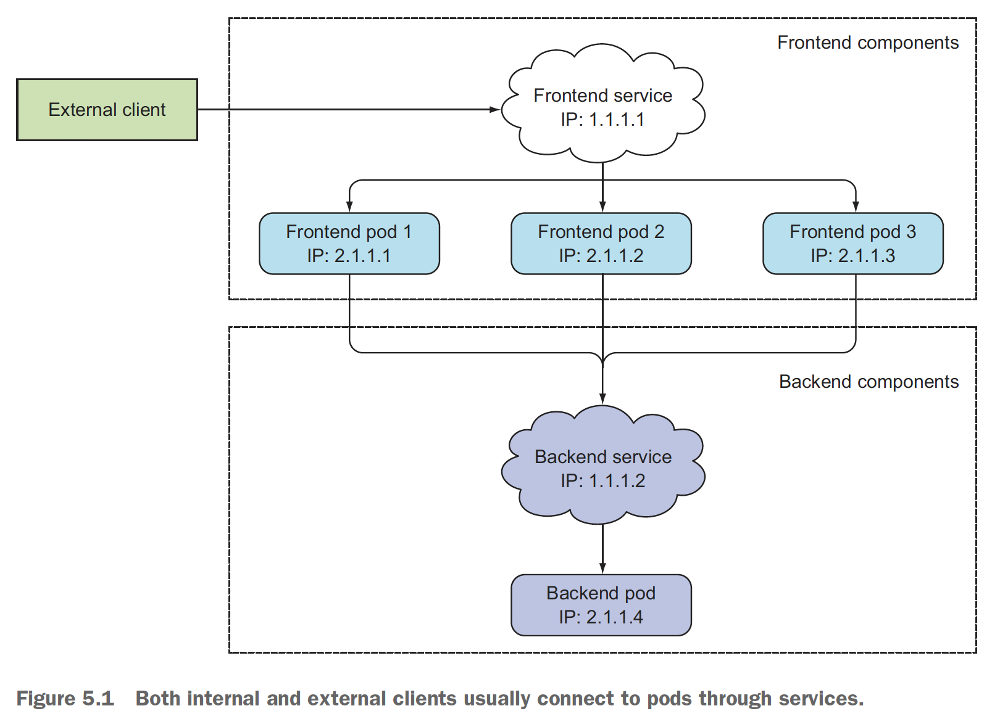
> 그림과 같이 외부 서비스가 프론트엔드를 찾기 위한 서비스(IP-1) 그리고 프론트엔드가 백엔드를 찾기 위한 서비스(IP-2)가 생성되고 고정된 IP 주소가 노출되며, 개별 프론트엔드 파드의 IP 주소가 변경되더라도 해당 서비스의 IP 는 변경되지 않습니다.

### 5.1.1 서비스 생성
> 해당 서비스는 레이블 셀렉터 (Label selector)를 통해 자신이 어떤 파드를 담당해야 하는지 결정할 수 있습니다
> '서비스'를 생성하는 가장 쉬운 방법은 ```kubectl expose``` 명령어입니다. 이는 모든 파드를 단일 IP 주소와 PORT 로 노출시킵니다.
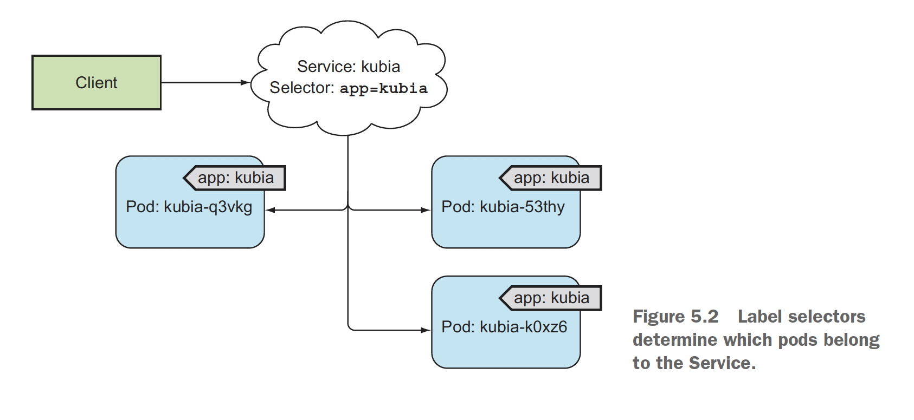
* 서비스를 생성하기 위한 설정파일을 만듭니다
  - 라벨이 'kubia' 인 파드의 8080 포트를 80 포트로 라우팅 하는 서비스를 생성합니다
```yaml
apiVersion: v1
kind: Service
metadata:
  name: kubia
spec:
  ports:
  - port: 80
    targetPort: 8080
  selector:
    app: kubia
```
* 간단한 웹서버와 이를 연결하는 서비스를 구성합니다
  - 서비스를 생성하고, 내부 IP 할당이 되었는지 확인합니다
  - 책에서는 별도의 파드생성이 없기 때문에 4장에서 사용했던 kubia-rc.yaml 파일을 이용하여 파드를 생성합니다
  - 생성된 서비스에 대해 정상여부를 확인하기 위해 ```kubectl exec``` 명령어를 통해 curl 커맨드를 이용합니다
  - 명령어의 더블 대시(--)는 kubectl 명령줄 옵션의 끝을 의미합니다. 
  - 즉, -- 이후의 모든 문자열은 파드 내에서 실행되는 명령어 이며, 명령줄 내에 대시로 시작하는 인수가 없다면 더블대시를 사용할 필요는 없습니다
```bash
bash> # 1. 서비스를 생성합니다
kubectl create -f kubia-svc.yaml
kubectl get all  # 내부 IP 가 10.102.166.80 으로 할당되어 있음을 확인할 수 있습니다

NAME                 TYPE        CLUSTER-IP      EXTERNAL-IP   PORT(S)   AGE
service/kubernetes   ClusterIP   10.96.0.1       <none>        443/TCP   15d
service/kubia        ClusterIP   10.102.166.80   <none>        80/TCP    2m29s


bash> # 2. ReplicationController 파드를 생성
kubectl create -f kubia-rc.yaml
replicationcontroller/kubia created


bash> # 3. 임의의 파드에 대해서 curl 명령을 통해 자신과 서비스에 대해서도 테스트해 봅니다

kubectl get po -o=custom-columns=NAME:.metadata.name
NAME
kubia-6b9wj
kubia-pmzwn
kubia-txc9c

kubectl exec kubia-6b9wj -- curl -s http://localhost:8080
You've hit kubia-6b9wj

for x in $(seq 1 5) ; do kubectl exec kubia-6b9wj -- curl -s http://10.102.166.80 ; sleep 0.5 ; done
You've hit kubia-txc9c
You've hit kubia-txc9c
You've hit kubia-txc9c
You've hit kubia-pmzwn
You've hit kubia-txc9c
```
* 명령어를 수행하는 과정에 대한 설명
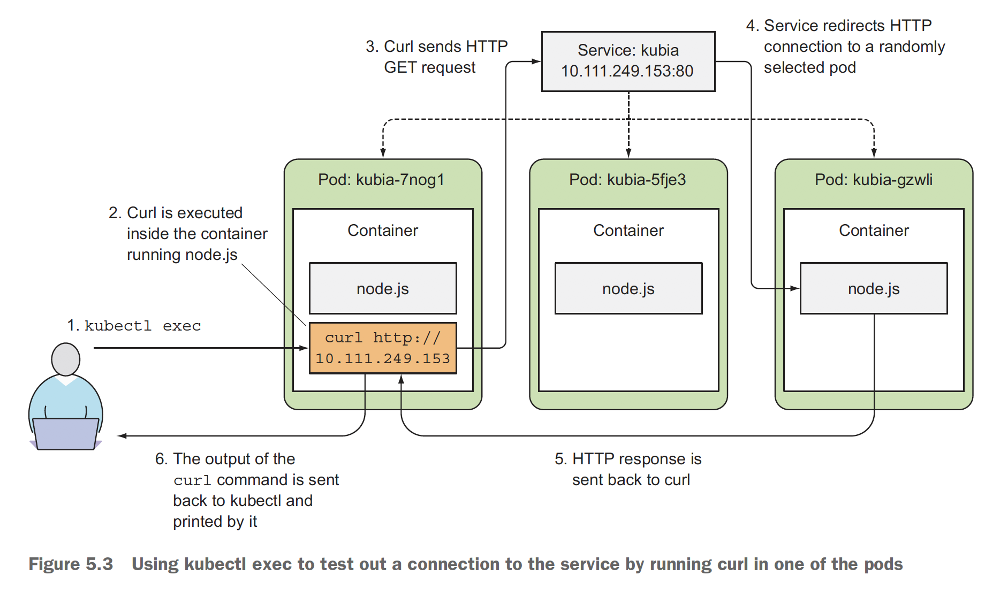
* 서비스의 세션 어피니티 구성
  - 동일한 ClientIP 에 대해서 동일한 파드로 서비스를 제공할 수 있도록 리다이렉트 할 수 있도록 SessionAffinity 속성을 None(Default) -> ClientIP 로 설정합니다
  - 기존에 생성된 파드를 바라보도록 레이블셀렉터는 kubia 로 설정합니다
```yaml
apiVersion: v1
kind: Service
metadata:
  name: kubia-clientip
spec:
  sessionAffinity: ClientIP
  ports:
  - port: 80
    targetPort: 8080
  selector:
    app: kubia
```
* 세션 어피니티 속성을 주고 테스트합니다
  - 쿠버네티스는 None 과 ClientIP 두 가지의 서비스 세션 어피니티만 지원합니다
  - 쿠키 기반의 세션 어피니티는 지원하지 않는데 이는 쿠버네티스가 HTTP 수준에서(L7) 동작하지 않기 때문입니다
  - 즉, L4 레이어 수준에서 TCP 와 UDP 패킷을 처리하고 페이로드(payload)는 신경쓰지 않습니다
```bash
bash> # 동일한 파드로만 전송됨을 확인합니다
for x in $(seq 1 10) ; do kubectl exec kubia-6b9wj -- curl -s http://10.111.2.56 ; sleep 0.5 ; done
You've hit kubia-clientip-vhmx7
You've hit kubia-clientip-vhmx7
You've hit kubia-clientip-vhmx7
You've hit kubia-clientip-vhmx7
You've hit kubia-clientip-vhmx7
You've hit kubia-clientip-vhmx7
You've hit kubia-clientip-vhmx7
You've hit kubia-clientip-vhmx7
You've hit kubia-clientip-vhmx7
You've hit kubia-clientip-vhmx7

kubectl get svc kubia-clientip -o json | grep sessionAffinity
```
* 좀 더 단순한 예제를 위해 정적인 파드 설정파일을 생성합니다
  - 현재 luksa/kubia 이미지는 8080 포트를 사용하도록 작성된 이미지이므로 80, 8080 포트를 바라보도록 2개의 파드를 생성합니다
```bash
bash> cat kubia-po-named.yml
apiVersion: v1
kind: Pod
metadata:
  name: kubia-named
  labels:
    app: kubia-named
spec:
  containers:
  - name: broker
    image: nginx
    ports:
    - name: http
      containerPort: 80
  - name: webapp
    image: luksa/kubia
    ports:
    - name: https
      containerPort: 8080
```
* 해당 파드를 바라보는 서비스를 구성합니다
  - 해당 http, https 를 바라보는 포트를 81, 82 번으로 구성합니다
  - 이렇게 구성하는 경우 향후 서비스 수준에서 포트 변경에 자유롭게 됩니다
```bash
bash> cat kubia-svc-named.yml
apiVersion: v1
kind: Service
metadata:
  name: kubia-named
spec:
  ports:
  - name: http
    port: 81
    targetPort: http
  - name: https
    port: 82
    targetPort: https
  selector:
    app: kubia-named
```
* 하나의 파드에 여러개의 어플리케이션을 실행하는 rc 를 구성합니다
  - 별도의 파드를 통한 실행은 계속 실패(kubia-po-named.yml)하여 리플리케이션 컨트롤러(kubia-rc-named.yml)를 통해 수행합니다
  - 해당 파드를 서비스하는 멀티포트 서비스를 실행합니다
  - 단, replicas=3 의 경우는 잘 동작하지만 replicas=1 이나 pods 만 구성 시에는 제대로 동작하지 않습니다
```bash
bash> kubectl create -f kubia-rc-named.yml
kubectl get pods
NAME                    READY   STATUS    RESTARTS   AGE
pod/kubia-4pkgl         1/1     Running   1          9d
pod/kubia-h76qz         1/1     Running   1          9d
pod/kubia-named-qd5x7   2/2     Running   0          31s
pod/kubia-named-v8wfw   2/2     Running   0          31s
pod/kubia-named-xsnwb   2/2     Running   0          31s
pod/kubia-x586c         1/1     Running   1          9d

bash> kubectl create -f kubia-svc-named-ports.yaml
service/kubia-named created

bash> kubectl get services kubia-named
NAME                     TYPE        CLUSTER-IP       EXTERNAL-IP   PORT(S)         AGE
service/kubia-named      ClusterIP   10.111.243.221   <none>        81/TCP,82/TCP   37m

bash> kubectl exec kubia-named-kvcwv -c broker -- curl -s 10.111.243.221:81
<!DOCTYPE html>
<html>
<head>
<title>Welcome to nginx!</title>
...

bash> kubectl exec kubia-named-kvcwv -c broker -- curl -s 10.111.243.221:82
You've hit kubia-named-v8wfw

```

### 5.1.2 서비스 검색
> 환경변수를 이용하는 방법과, DNS를 이용한 방법으로 IP 와 PORT 를 확인할 수 있는데요, 쿠버네티스는 *항상 파드가 시작되는 시점에 각 서비스를 기리키는 환경변수 세트를 초기화*합니다

* 환경변수를 통한 방법
  - env 명령을 통해 해당 파드의 환경변수를 확인합니다
  - 해당 서비스명을 특수문자 치환과 대문자 처리된 prefix 를 붙여 서비스의 환경변수 키를 지정합니다
```bash
bash> kubectl exec kubia-named env
...
KUBERNETES_SERVICE_HOST=10.96.0.1
KUBERNETES_SERVICE_PORT=443
...
KUBIA_NAMED_SERVICE_HOST=10.111.90.78   # 서비스의 클러스터IP 
KUBIA_NAMED_SERVICE_PORT=81             # 서비스의 포트
...
```

* DNS를 이용하는 방법
  - kube-system 네임스페이스에는 kube-dns 라고 하는 서비스가 존재하며 이는 DNS 서버를 실행하는 파드를 통해, 클러스터에서 실행중인 모든 파드는 자동으로 이를 사용하도록 구성됩니다
  - 쿠버네티스는 각 컨테이너의 /etc/resolv.conf 파일을 수정해 이를 수행하며, *파드에서 실행 중인 프로세스의 모든 DNS 쿼리는 쿠버네티스 자체 DNS 서버로 처리*됩니다
    + 파드 내부 DNS 사용여부는 각 파드 스펙의 dnsPolicy 속성으로 구성할 수 있습니다
  - 각 서비스는 내부 DNS 서버에서 DNS 항목을 가져오고, 서비스 이름을 알고 있는 클라이언트 파드는 환경변수 대신 FQDN(Fully Qualified Domain Name, 정규화된 도메인 이름)으로 액세스가 가능합니다
```bash
bash> kubectl get svc -n kube-system -o wide | grep -i dns
kube-dns   ClusterIP   10.96.0.10   <none>        53/UDP,53/TCP,9153/TCP   28d   k8s-app=kube-dns

bash> kubectl describe po coredns-66bff467f8-dgbf6 -n kube-system | grep kube-dns
Labels:               k8s-app=kube-dns
```

* FQDN을 통한 서비스 연결
  - kubia 는 서비스 이름이고, *svc.cluster.local 은 로컬 서비스 이름에 사용되는 클러스터의 도메인 접미사*입니다
  - 같은 네임스페이스에 있는 경우 svc.cluster.local 과 namespace 는 생략이 가능하여 kubia 로 접근이 가능합니다

```bash
bash>
kubectl exec -it kubia-4pkgl bash
root@kubia-4pkgl:/# curl http://kubia-named
You've hit kubia-named-x586c

root@kubia-4pkgl:/# curl http://kubia-named.default.svc.cluster.local
You've hit kubia-named-x586c

root@kubia-4pkgl:/# curl http://kubia-named.default
You've hit kubia-named-x586c

# 파드 컨테이너 내부의 DNS resolver 구성을 확인할 수 있습니다 (쿠버네티스는 각 컨테이너의 /etc/resolv.conf 파일을 수정해서 적용합니다)
root@kubia-4pkgl:/# cat /etc/resolv.conf
nameserver 10.96.0.10
search default.svc.cluster.local svc.cluster.local cluster.local
options ndots:5
```
* 서비스 IP에 핑을 할 수 없는 이유
  - 서비스의 클러스터의 IP가 *가상 IP* 이므로 서비스 포트와 결합된 경우에만 의미가 있습니다
  - 즉, 파드(동일한 IP) 내에 여러 컨테이너 서비스를 포워드 할 수도 있기 때문에 IP+PORT 를 통해서 실제 컨테이너의 IP를 알 수 있기 때문입니다


## 5.2 클러스터 외부에 있는 서비스 연결
> 외부 요청이 클러스터 내부에 연결하는 여태까지의 서비스 기능과 반대로, 외부에 존재하는 서비스를 내부에서 접근할 수 있도록 외부 IP 와 PORT 로 연결을 전달할 수 있습니다

### 5.2.1 서비스 엔드포인트 소개
> 서비스는 파드와 직접 연결되지 않으며, 엔드포인트 리소스를 통해 연결됩니다. 그리고 파드 셀렉터는 엔드포인트를 생성할 때에 사용되는 질의문이라고 볼 수 있습니다
* 서비스의 상세정보와 엔드포인트 정보를 확인합니다
```bash
bash> 
kubectl describe service kubia-named
Name:              kubia-named
Namespace:         default
Labels:            <none>
Annotations:       <none>
Selector:          app=kubia-named  # 엔드포인트 목록 조회에 사용되며, 컨테이너 접근시에 직접 활용되지 않습니다
Type:              ClusterIP
IP:                10.99.90.252
Port:              <unset>  80/TCP
TargetPort:        8080/TCP
Endpoints:         172.18.0.5:8080,172.18.0.6:8080,172.18.0.7:8080  # 엔드포인트의 IP:PORT
Session Affinity:  None
Events:            <none>


kubectl get endpoints kubia-named  # 엔드포인트는 항상 복수입니다
NAME    ENDPOINTS                                         AGE
kubia-named   172.18.0.5:8080,172.18.0.6:8080,172.18.0.7:8080   29m
```

### 5.2.2 서비스 엔드포인트 수동 구성
> 파드 셀렉터 없이 서비스를 생성하면 쿠버네티스는 엔드포인트 리소스를 생성할 수 없으며, 직접 생성해야만 한다.
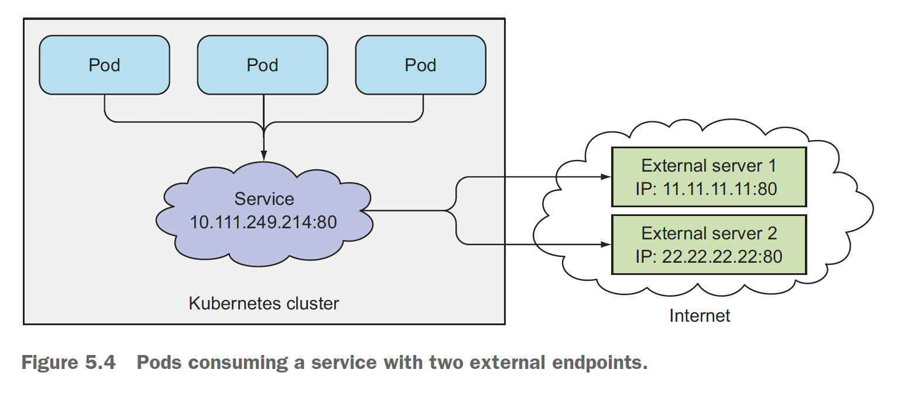

* 셀렉터 없는 서비스 생성
  - 라벨 셀렉터가 없는 서비스 파일을 생성하여, *쿠버네티스 클러스터 외부 인터넷 서비스와 연동 가능한 서비스를 생성*할 수 있습니다.
  - 추후 해당 외부 서비스를 쿠버네티스 서비스로 전환 시에 라벨 셀렉터를 추가하여 마이그레이션이 가능합니다
```bash
bash> cat external-service.yml
apiVersion: v1
kind: Service
metadata:
  name: external-service
spec:
  ports:
  - port: 80

bash> cat external-service-endpoints.yaml
apiVersion: v1
kind: Endpoints
metadata:
  name: external-service
subsets:
  - addresses:
    - ip: 11.11.11.11
    - ip: 22.22.22.22
    ports:
    - port: 80 
```

### 5.2.3 외부 서비스를 위한 별칭 생성
> 서비스의 엔드포인트를 수동으로 구성하는 방법 외에도 FQDN을 통해 참조할 수도 있습니다.

* *ExternalName* 서비스 생성
  - 서비스가 생성되면 FQDN 대신 external-service.default.svc.cluster.local 혹은 external-service 로 외부 서비스에 연결이 가능합니다 
  - 이렇게 외부 서비스에 대한 정보를 숨기고 서비스 유지 개선이 가능합니다
  - ExternalName 서비스는 DNS 레벨에서만 구현되며, [CNAME DNS](https://dev.plusblog.co.kr/30) 레코드(A레코드와 같은 IP가 아니라 별칭 Domain 주소)가 생성되므로 ClusterIP 를 얻지는 못합니다
```bash
bash> cat external-service-externalname.yaml
apiVersion: v1
kind: Service
metadata:
  name: external-service
spec:
  type: ExternalName
  externalName: someapi.somecompany.com
  ports:
  - port: 80
```


## 5.3 외부 클라이언트에 서비스 노출
> 지금까지는 클러스터 내부에서 파드가 서비스를 이용했으나, 외부 클라이언트가 서비스를 호출하는 경우에 대해 학습합니다. 외부에 서비스를 노출하는 방법은 3가지(NodePort, LoadBalancer, Ingress) 정도가 존재합니다

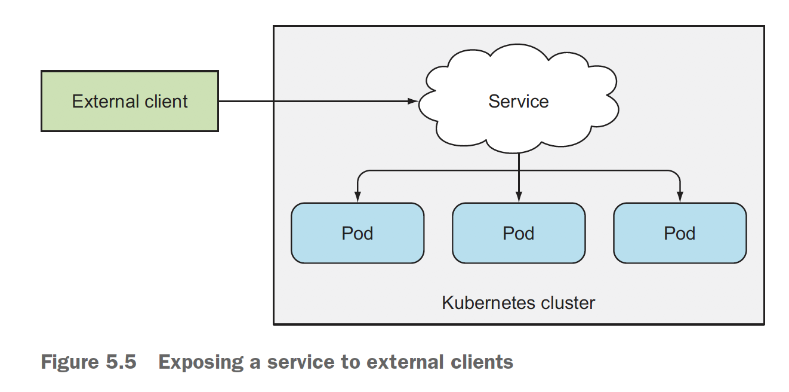

### 5.3.1 노드포트 서비스 사용
> 모든 노드에 특정 포트를 할당하고, 대응하는 외부 요청을 파드에 전달합니다
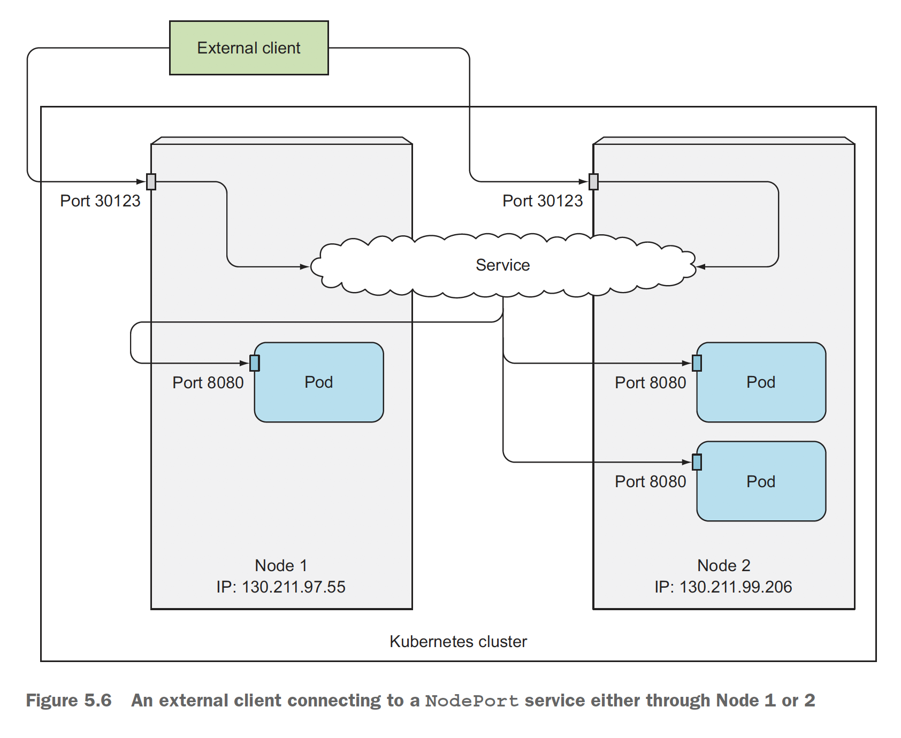
* 노드포트 서비스 생성
  - 책에서는 EXTERNAL-IP 설정에 <nodes> 라고 나온다고 하지만 실제 minikube 및 GKE 환경에서는 <none>으로 출력됩니다
```bash
bash> cat kubia-svc-nodeport.yaml
apiVersion: v1
kind: Service
metadata:
  name: kubia-nodeport
spec:
  type: NodePort
  ports:
  - port: 80
    targetPort: 8080
    nodePort: 30123
  selector:
    app: kubia

bash> kubectl get svc kubia-nodeport -o wide
NAME             TYPE       CLUSTER-IP     EXTERNAL-IP   PORT(S)        AGE   SELECTOR
kubia-nodeport   NodePort   10.3.243.117   <none>        80:30123/TCP   56s   app=kubia
```
* 외부 클라이언트가 노트포트에 액세스하기 위한 방화벽 오픈 
  - 노드포트를 통해 서비스에 접근하기 위해서는 외부 연결을 허용하기 위한 GCP 수준의 방화벽 구성이 필요합니다
  - "VPC network > Firewall" 에서 확인 할 수 있습니다
```bash
bash> gcloud compute firewall-rules create kubia-svc-rule --allow=tcp:30123
```
* JSONPath 를 이용하여 모든 노드의 IP 가져오기
  - 이와 같이 인터넷 어디서든 노드의 IP 로 접근이 가능하지만, *특정 노드의 장애 시에 임의의 노드에 접근가능하도록 로드밸런서를 배치*하는 편이 좋다
```bash
bash> kubectl get nodes -o jsonpath='{.items[*].status.addresses[?(@.type=="ExternalIP")].address}'
34.64.85.181 34.64.113.8 34.64.190.161 34.64.238.210

bash> for ip in `kubectl get nodes -o jsonpath='{.items[*].status.addresses[?(@.type=="ExternalIP")].address}'`; do curl -s http://$ip:30123; done
You've hit kubia-vp2tg
You've hit kubia-7jx9t
You've hit kubia-7jx9t
You've hit kubia-pdjkh
```

### 5.3.2 외부 로드밸런서로 서비스 노출
> 공개적으로 액세스 가능한 고유한 IP 주소를 가지며 모든 연결을 서비스로 전달합니다. 따라서 로드밸런서의 IP 주소로 서비스에 액세스 할 수 있습니다. 마치 L4, L7 과 유사해 보입니다.
> 즉, **LoadBalancer 서비스는 추가 인프라 제공 로드밸런서가 있는 NodePort 서비스**라고 말할 수 있습니다

* 로드밸런서 서비스 생성
  - AWS, GCP, Azure 와 같은 Cloud Provider 에서 실행하는 경우 인프라에서 제공하는 로드밸런서를 자동으로 프로비저닝해 주며, Minikube 의 경우는 지원하지 않습니다.
```bash
bash> cat kubia-svc-loadbalancer.yaml
apiVersion: v1
kind: Service
metadata:
  name: kubia-loadbalancer
spec:
  type: LoadBalancer
  ports:
  - port: 80
    targetPort: 8080
  selector:
    app: kubia
```
* 로드밸런서를 통한 외부 접속 테스트
  - 노드포트 서비스와 다르게 방화벽 설정 없이 외부 접속이 가능합니다
```bash
bash> for x in $(seq 1 5); do curl -s http://34.64.113.8/ ; sleep 0.5 ; done
You've hit kubia-7nvqb
You've hit kubia-4xjjt
You've hit kubia-7nvqb
You've hit kubia-7nvqb
You've hit kubia-p7njg
```
* 웹 브라우저를 통한 접근은 매번 같은 파드를 호출하는데...
  - Session Affinity 노 None 이지만 브라우저의 keep-alive 연결을 통해 같은 연결로 요청을 보내기 때문입니다
  - 포트를 지정하지 않으면 NodePort 의 포트가 임의의 포트로 쿠버네티스가 알아서 지정합니다
```bash
bash> kubectl describe svc kubia-loadbalancer
...
TargetPort:               8080/TCP
NodePort:                 <unset>  32584/TCP
Session Affinity:         None
External Traffic Policy:  Cluster
...
```
* Advanced REST client 와 같은 도구를 통해 close Connection 을 수행해 봅니다
  - Request Header 의 "Connection:close" 설정을 하면 매번 변경되는 것을 확인할 수 있습니다
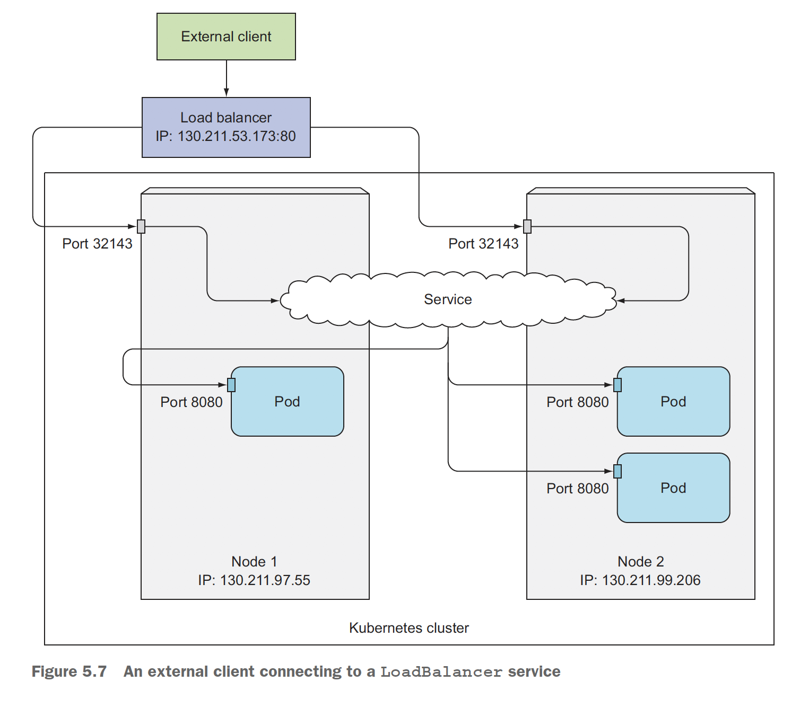

### 5.3.3 외부 연결의 특성 이해
* 불필요한 네트워크 홉의 이해와 예방
  - 외부 클라이언트가 NodePort 를 통해 서비스에 접속할 경우 LoadBalancer 의 경우 임의의 노드를 선택하고, 다시 임의의 선택된 파드가 해당 노드에는 없을 수도 있는데 이러한 경우 *추가적인 네트워크 홉*이 필요할 수 있습니다
  - 이러한 상황을 피하기 위해 externalTrafficPolicy 필드를 Local 로 지정할 수 있으며 서비스 프록시는 로컬에 실행 중인 파드를 선택하게 됩니다
  - 다만, 노드가 2개이고, 파드가 3개인 경우 2개의 파드가 존재하는 노드에는 부하 분산이 덜 되므로 총 50%, 25%, 25% 로 부하분산이 제대로 되지 않는 문제가 발생합니다
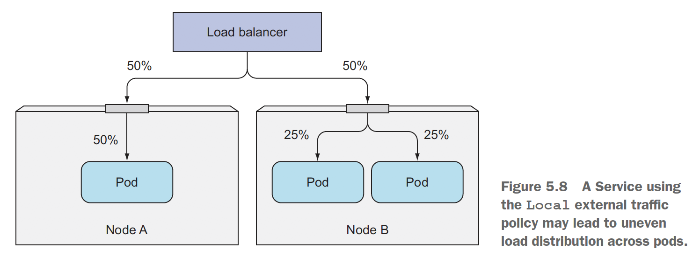
* 클라이언트 IP가 보존되지 않음 인식
  - NodePort 를 통해 서비스되는 경우 패킷에서 *소스 네트워크 주소 변환*(SNAT)이 발생하여 파드는 실제 클라이언트의 IP를 알아낼 수가 없지만, Local External Traffic Policy 정책의 경우 추가 홉이 발생하지 않기 때문에 [원본 소스 IP 주소를 보존합니다](https://kubernetes.io/ko/docs/tutorials/services/source-ip/#type-nodeport-%EC%9D%B8-%EC%84%9C%EB%B9%84%EC%8A%A4%EC%97%90%EC%84%9C-%EC%86%8C%EC%8A%A4-ip).


## 5.4 인그레스 리소스로 서비스 외부 노출
> LB 서비스는 IP 주소를 기준으로 서비스를 연결해 주지만 Ingress 서비스는 한 IP 주소로 수십 개의 서비스에 접근이 가능하도록 지원해 줍니다. Ingress 는 네트워크 스택의 Application Layer 즉, HTTP 에서 동작하며, 쿠키 기반 세션 어피니티 등과 같은 기능을 제공할 수 있습니다.
> LoadBalancer 가 L4 라고 하면 Ingress 는 L7 이라고 말할 수 있겠습니다.
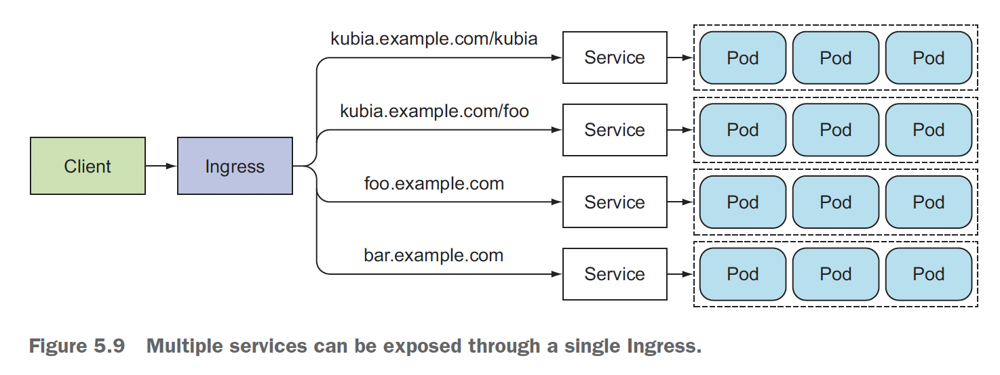

* Minikube Ingress addons 활성화
  - GCP 상에서 기동되는 파드가 이렇게나 많을 줄은 몰랐네요, kube-system 네임스페이스에서 기동되는 파드가 어마어마합니다
```bash
bash> minikube addons list
...
- ingress: disabled
...
bash> minikube addons enable ingress

bash> kubectl get po --all-namespaces  # 모든 네임 스페이스에서 모든 파드를 출력합니다 
NAMESPACE     NAME                                                             READY   STATUS    RESTARTS   AGE
default       kubia-4xjjt                                                      1/1     Running   0          5h23m
default       kubia-7nvqb                                                      1/1     Running   0          5h23m
default       kubia-p7njg                                                      1/1     Running   0          5h23m
kube-system   event-exporter-v0.3.0-5cd6ccb7f7-v8bt6                           2/2     Running   0          2d
kube-system   fluentd-gcp-scaler-6855f55bcc-l5f8h                              1/1     Running   0          2d
kube-system   fluentd-gcp-v3.1.1-64phf                                         2/2     Running   0          5h22m
kube-system   fluentd-gcp-v3.1.1-ft96k                                         2/2     Running   0          5h22m
kube-system   fluentd-gcp-v3.1.1-vrmlp                                         2/2     Running   0          2d
kube-system   fluentd-gcp-v3.1.1-vz87r                                         2/2     Running   0          5h22m
kube-system   heapster-gke-6d5d65c667-s8dj9                                    3/3     Running   0          2d
kube-system   kube-dns-5c446b66bd-bbvkl                                        4/4     Running   0          2d
kube-system   kube-dns-5c446b66bd-hwsql                                        4/4     Running   0          5h22m
kube-system   kube-dns-autoscaler-6b7f784798-v7dfc                             1/1     Running   0          2d
kube-system   kube-proxy-gke-psyoblade-container--default-pool-1b2bb42a-731g   1/1     Running   0          2d
kube-system   kube-proxy-gke-psyoblade-container-284316-pool-1-eca67292-3wbv   1/1     Running   0          5h22m
kube-system   kube-proxy-gke-psyoblade-container-284316-pool-1-eca67292-dw2c   1/1     Running   0          5h22m
kube-system   kube-proxy-gke-psyoblade-container-284316-pool-1-eca67292-qbh1   1/1     Running   0          5h22m
kube-system   l7-default-backend-84c9fcfbb-88vpv                               1/1     Running   0          2d
kube-system   metrics-server-v0.3.3-fdc67d4b6-sw2pd                            2/2     Running   0          2d
kube-system   prometheus-to-sd-ds8ws                                           2/2     Running   0          5h22m
kube-system   prometheus-to-sd-h4k4r                                           2/2     Running   0          5h22m
kube-system   prometheus-to-sd-hc25h                                           2/2     Running   0          5h22m
kube-system   prometheus-to-sd-kslhk                                           2/2     Running   0          2d
kube-system   stackdriver-metadata-agent-cluster-level-6b7c498f59-8v42p        2/2     Running   0          2d
```

### 5.4.1 인그레스 리소스 생성 
* kubia.example.com 으로 요청되는 모든 HTTP 요청을 지정된 kubia-nodeport 80 포트로 전송하는 규칙을 정의합니다 
  - 5.3 장에서 생성한 NodePort 서비스가 기동되어 있어야 제대로 동작합니다
  - "NodePort + FirewallOpen" 방식, "LoadBalancer" 방식 그리고 "NodePort + Ingress" 이렇게 3가지가 가능합니다
```bash
bash> cat kubia-ingress.yaml
apiVersion: extensions/v1beta1
kind: Ingress
metadata:
  name: kubia
spec:
  rules:
  - host: kubia.example.com
    http:
      paths:
      - path: /
        backend:
          serviceName: kubia-nodeport
          servicePort: 80
```

### 5.4.2 인그레스로 서비스 액세스
* 인그레스의 IP 주소 얻기
  - 얻어낸 IP를 이용해서 /etc/hosts 파일에 추가합니다
  - GCP 환경에서도 약 1분 정도 소요되므로 인내심을 가지고 기다려야 합니다
```bash
bash> kubectl get ingresses
NAME    HOSTS             ADDRESS          PORTS   AGE
kubia   kubia.suhyuk.me   34.107.227.125   80      67s

bash> cat /etc/hosts
34.107.227.125  kubia.suhyuk.me

bash> for x in $(seq 1 5); do curl -s http://kubia.suhyuk.me/ ; sleep 0.5 ; done
You've hit kubia-p7njg
You've hit kubia-p7njg
You've hit kubia-4xjjt
You've hit kubia-4xjjt
You've hit kubia-4xjjt
```

* 인그레스 동작방식 이해
  - 클라이언트의 DNS(hosts) 조회 통해 Ingress Controller 의 IP 를 획득합니다 
  - HTTP 요청을 통해 Request Header 에 "Host: kubia.suhyk.me" 와 함께 HTTP GET 요청을 합니다 
  - 인그레스 컨트롤러는 해당 헤더에서 액세스하려는 서비스를 결정하고 엔드포인트 오브젝트로 파드 IP를 조회합니다
  - 최종 획득한 IP 를 통해서 개별 파드에 요청을 컨트롤러가 전달합니다
```bash
# Request Header parsed
GET / HTTP/1.1
Host: kubia.suhyuk.me
Connection: keep-alive
Cache-Control: max-age=0
Upgrade-Insecure-Requests: 1
User-Agent: Mozilla/5.0 (Macintosh; Intel Mac OS X 10_15_6) AppleWebKit/537.36 (KHTML, like Gecko) Chrome/85.0.4183.121 Safari/537.36
Accept: text/html,application/xhtml+xml,application/xml;q=0.9,image/avif,image/webp,image/apng,*/*;q=0.8,application/signed-exchange;v=b3;q=0.9
Accept-Encoding: gzip, deflate
Accept-Language: ko-KR,ko;q=0.9,en-US;q=0.8,en;q=0.7
```
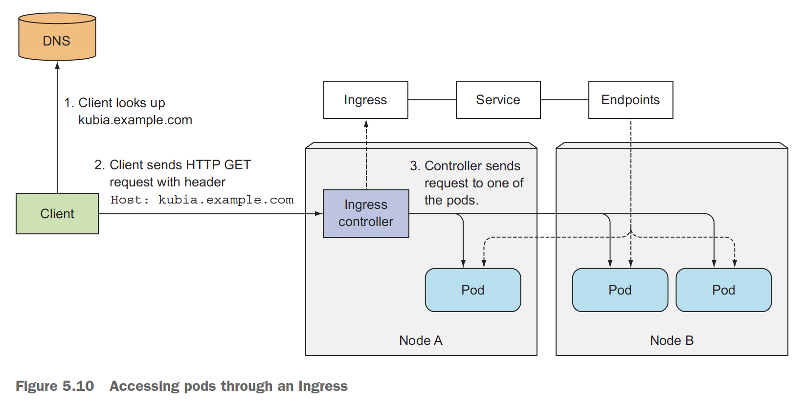


### 5.4.3 하나의 인그레스로 여러 서비스 노출
> [동일한 IP에 여러 URI를 통해서 팬아웃](https://kubernetes.io/docs/concepts/services-networking/ingress/#simple-fanout)할 수 있습니다
* [Simple fanout](https://kubernetes.io/docs/concepts/services-networking/ingress/#simple-fanout)
```yaml
apiVersion: networking.k8s.io/v1
kind: Ingress
metadata:
  name: simple-fanout-example
spec:
  rules:
  - host: foo.bar.com
    http:
      paths:
      - path: /foo
        pathType: Prefix
        backend:
          service:
            name: service1
            port:
              number: 4200
      - path: /bar
        pathType: Prefix
        backend:
          service:
            name: service2
            port:
              number: 8080
```

### 5.4.4 TLS (Transport Layer Security) 트래픽을 처리하도록 인그레스 구성
> HTTPS 지원을 위한 TLS 설정을 포함한 인그레스 구성을 합니다

* 순차적으로 key, cert 파일 생성 후, secret 을 생성합니다
  - 마찬가지로 Ingress 주소를 hosts 파일에 등록 후 접속합니다
```bash
bash> openssl genrsa -out tls.key 2048
Generating RSA private key, 2048 bit long modulus (2 primes)
...

bash> openssl req -new -x509 -key tls.key -out tls.cert -days 360 -subj /CN=kubia.suhyuk.me
bash> kubectl create secret tls tls-secret --cert=tls.cert --key=tls.key
secret/tls-secret created

bash> curl -k -v https://kubia.suhyuk.me
*   Trying 35.244.218.25:443...
* TCP_NODELAY set
* Connected to kubia.suhyuk.me (35.244.218.25) port 443 (#0)
...
You've hit kubia-7nvqb
* Connection #0 to host kubia.suhyuk.me left intact

bash> curl -k -v http://kubia.suhyuk.me
*   Trying 35.244.218.25:80...
* TCP_NODELAY set
* Connected to kubia.suhyuk.me (35.244.218.25) port 80 (#0)
...
You've hit kubia-7nvqb
* Connection #0 to host kubia.suhyuk.me left intact

```


## 5.5 파드가 연결을 수락할 준비가 됐을 때 신호 보내기
> 기동된 파드가 네트워크 요청을 받을 준비가 되지 않았을 경우를 대비해 여유시간이 필요한 경우가 있습니다. 이런 상황을 대비해 Readiness Probe 를 통해 가능합니다
> *주기적으로 파드에 호출하여 특정 파드가 클라이언트 요청을 수신할 수 있는지를 결정*합니다

### 5.5.1 레디니스 프로브 소개
* 레디니스 프로브는 3가지가 존재하며 아래의 기준으로 파드의 상태를 판단합니다
  - Exec Probe -> 프로세스 실행의 종료 코드를 기준으로 판단
  - HTTP GET Probe -> HTTP GET 요청의 상태 코드를 기준으로 판단
  - TCP Socker -> 컨테이너의 지정된 포트로 TCP 연결을 수행하고 연결되면 성공으로 판단
* 레디니스 프로브의 동작
  - 라이브니스 프로브와 달리 **컨테이너가 준비 상태 점검에 실패하더라도 컨테이너가 종료되거나 다시 시작되지 않**습니다
  - 해당 파드가 종료되는 것이 아니라 서비스에서 잠시 제외된다고 보면 되고, 파드 레비을이 서비스 레이블 셀렉터와 일치하지 않을 때와 같은 효과입니다
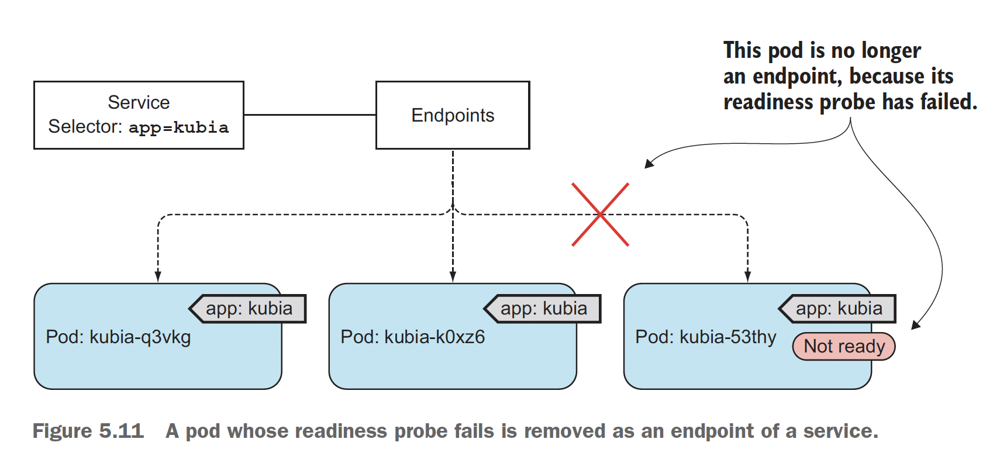
* 레디니스 프로브의 중요성
  - 특정 파드에 문제가 있다고 하더라도 정상적인 상태의 파드들로만 서비스 가능하도록 할 수 있습니다


### 5.5.2 파드에 레디니스 프로브 추가
* 이미 서비스 중인 RC에 대해 아래와 같이 readinessProbe 항목을 변경합니다
  - edit 명령을 통해 수정도 가능하지만 apply 가 좀 더 명시적인 것 같습니다
```bash
bash> cat kubia-rc-readinessprobe.yaml
apiVersion: v1
kind: ReplicationController
metadata:
  name: kubia
spec:
  replicas: 3
  selector:
    app: kubia
  template:
    metadata:
      labels:
        app: kubia
    spec:
      containers:
      - name: kubia
        image: luksa/kubia
        ports:
        - name: http
          containerPort: 8080
        readinessProbe:
          exec:
            command:
            - ls
            - /var/ready

bash> kubectl apply -f kubia-rc-readinessprobe.yaml
replicationcontroller/kubia configured
```
* 파드의 레디니스 상태 확인 및 수정
  - /var/ready 파일이 존재해야 정상으로 판단되지만, 이미 기동된 이미지는 영향을 받지 않습니다.
  - 임의의 파드를 삭제하고 해당 파드의 상태를 확인합니다
  - 10초 간격으로 프로브를 실행하므로 약간의 딜레이가 있지만, 금새 READY 상태로 변경됩니다
```bash
bash> kubectl get po
NAME          READY   STATUS    RESTARTS   AGE
kubia-4xjjt   1/1     Running   0          26h
kubia-7nvqb   1/1     Running   0          26h
kubia-p7njg   1/1     Running   0          26h

bash> kubectl delete po kubia-4xjjt
pod "kubia-4xjjt" deleted


bash> kubectl get po kubia-c4tkw
NAME          READY   STATUS    RESTARTS   AGE
kubia-7nvqb   1/1     Running   0          26h
kubia-c4tkw   0/1     Running   0          59s
kubia-p7njg   1/1     Running   0          26h

bash> kubectl describe po <new-pod>
...
  Warning  Unhealthy  1s    kubelet, gke-psyoblade-container-284316-pool-1-eca67292-dw2c  Readiness probe failed: ls: cannot access /var/ready: No such file or directory
...

bash> kubectl exec kubia-c4tkw -- touch /var/ready
```
* 가장 중요한 2가지를 기억해야 합니다 
  - 라이브 서비스의 경우 반드시 레디니스 프로브를 정의 합니다 (언제 이용자 요청이 발생할 지 모릅니다)
  - 레디니스 프로브에 파드의 종료 코드를 포함하지 않습니다 (파드 삭제 후 모든 서비스에서 파드가 삭제되므로 필요 없는 동작입니다)


## 5.6 헤드리스 서비스로 개별 파드 찾기

### 5.6.1 헤드리스 서비스 생성
* 헤드리스 서비스를 생성하고, 확인합니다
```bash
bash> cat kubia-svc-headless.yaml
...
    spec:
      containers:
      - name: kubia
        image: luksa/kubia
        ports:
        - name: http
          containerPort: 8080
        readinessProbe:
          exec:
            command:
            - ls
            - /var/ready

bash> kubectl create -f kubia-svc-headless.yaml
service/kubia-headless created

```

### 5.6.2 DNS로 파드 찾기
* YAML 매니피스트를 사용하지 않고 파드생성
  - 헤드리스 서비스의 경우 ClusterIP 가 없기 때문에 파드 서비스의 엔드포인트가 조회됩니다
  - [kubectl generators are deprecated](https://kubernetes.io/docs/reference/kubectl/conventions/)
  - 이렇게 헤드리스 서비스를 통해 *각 파드에 직접 IP로 액세스 할 수 있지만, 여전히 DNS 를 통해 조회되고, 로드밸런싱도 DNS 를 통한 라운드로빈 매커니즘*을 이용합니다
```bash
bash> kubectl run dnsutils --image=tutum/dnsutils --generator=run-pod/v1 --command -- sleep infinity
Flag --generator has been deprecated, has no effect and will be removed in the future.
pod/dnsutils created

bash> kubectl exec dnsutils -- nslookup kubia-headless
Server:		10.3.240.10
Address:	10.3.240.10#53

Name:	kubia-headless.default.svc.cluster.local
Address: 10.0.0.15
Name:	kubia-headless.default.svc.cluster.local
Address: 10.0.4.2
Name:	kubia-headless.default.svc.cluster.local
Address: 10.0.5.2
```

### 5.6.3 모든 파드 검색 - 준비되지 않은 파드도 포함
> 파드의 레디니스와 관계없이 모든 파드를 서비스에 추가하려면 [publishNotReadyAddresses=True](https://kubernetes.io/docs/concepts/services-networking/dns-pod-service/) 설정을 이용하면 됩니다

```bash
bash> cat kubia-svc-publish-not-ready.yaml


bash> kubectl create -f kubia-svc-publish-not-ready.yaml
service/kubia-all created

bash> kubectl get svc
NAME                 TYPE           CLUSTER-IP     EXTERNAL-IP   PORT(S)        AGE
kubernetes           ClusterIP      10.3.240.1     <none>        443/TCP        2d22h
kubia-all            ClusterIP      10.3.244.29    <none>        80/TCP         11s
kubia-headless       ClusterIP      None           <none>        80/TCP         24m
kubia-loadbalancer   LoadBalancer   10.3.255.147   34.64.113.8   80:32584/TCP   27h
kubia-nodeport       NodePort       10.3.246.224   <none>        80:30123/TCP   21h

bash> kubectl describe svc kubia-all  # 준비되지 않은 서비스도 포함되어 있으며
Name:              kubia-all
Namespace:         default
Labels:            <none>
Annotations:       <none>
Selector:          app=kubia
Type:              ClusterIP
IP:                10.3.244.29
Port:              <unset>  80/TCP
TargetPort:        8080/TCP
Endpoints:         10.0.0.15:8080,10.0.5.2:8080,10.0.5.3:8080
Session Affinity:  None
Events:            <none>

bash> kubectl describe svc kubia-headless  # 여기서는 준비된 파드만 포함되었습니다
Name:              kubia-headless
Namespace:         default
Labels:            <none>
Annotations:       <none>
Selector:          app=kubia
Type:              ClusterIP
IP:                None
Port:              <unset>  80/TCP
TargetPort:        8080/TCP
Endpoints:         10.0.0.15:8080,10.0.5.2:8080
Session Affinity:  None
Events:            <none>
```


## 9. 질문과 답변

### 9.1 [PING 은 몇 번 PORT 일까?](https://m.blog.naver.com/ssamba/125695893)
> 예전 부터 궁금해 했던 부분인데 좋은 블로그가 있어 참고 하였습니다. PING 은 ICMP(Internet Control Message Protocol) 라는 프로토콜을 기반으로 작성된 프로그램인데 OSI 7 Layer 상에서 IP/PORT 를 통해 전송 되는 Layer 는 Trasport 즉 4 Layer 이나, ICMP 는 3 Layer 에 해당하며 PORT 와는 무관합니다. 
* [TCP/IP의 분해와 IP Address의 이해](https://m.blog.naver.com/ssamba/125712071)도 참고하면 좋겠습니다

