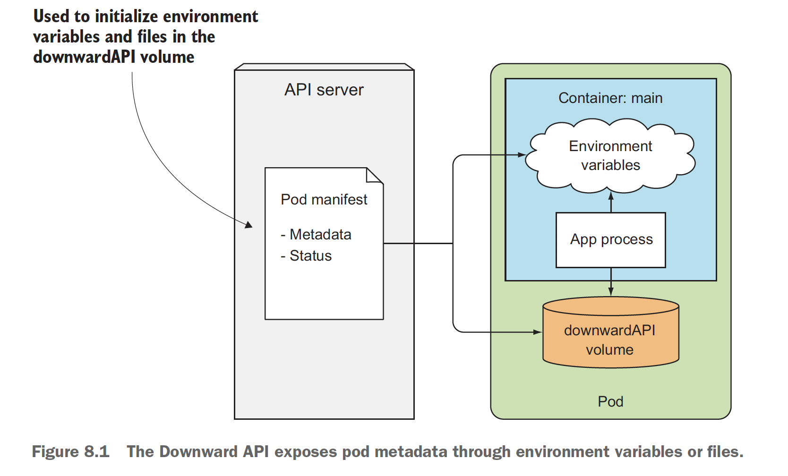
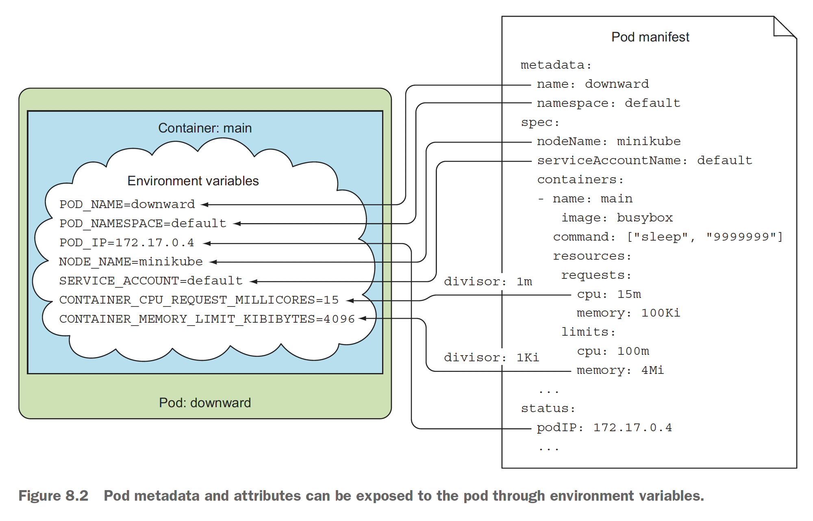
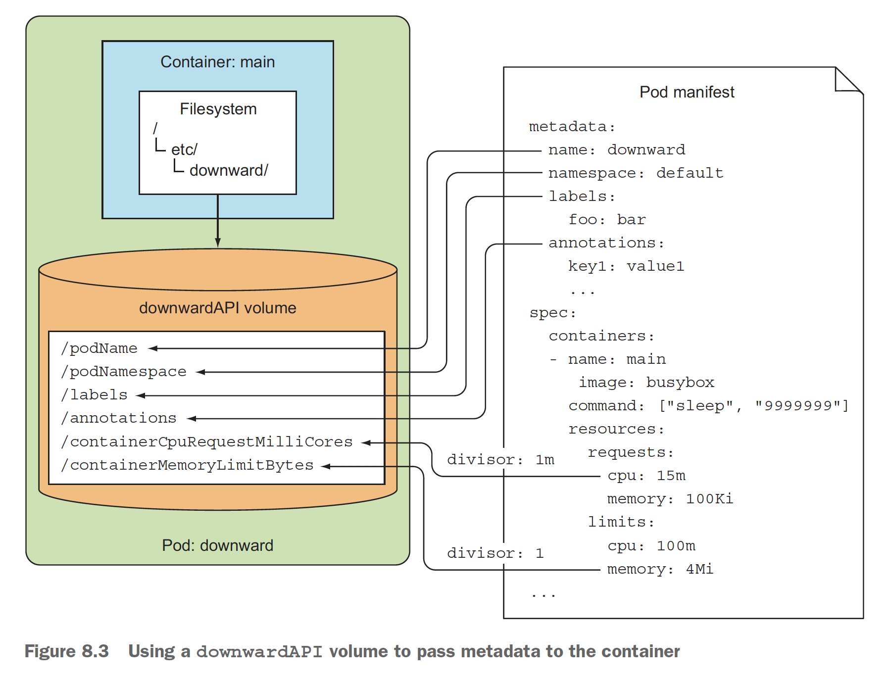
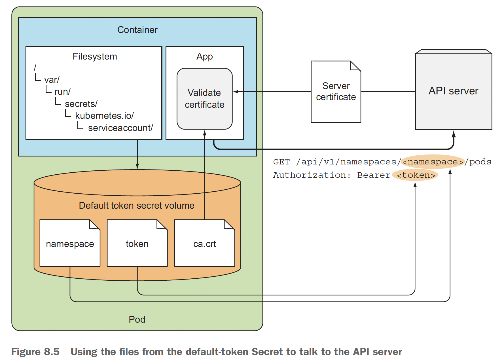
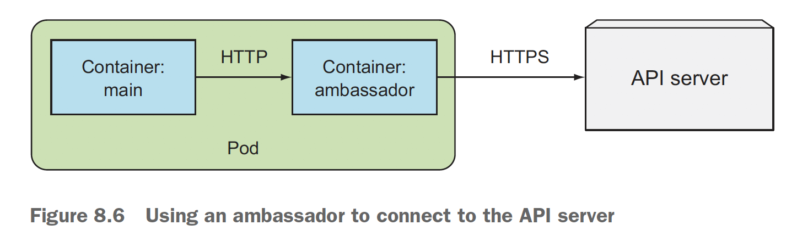
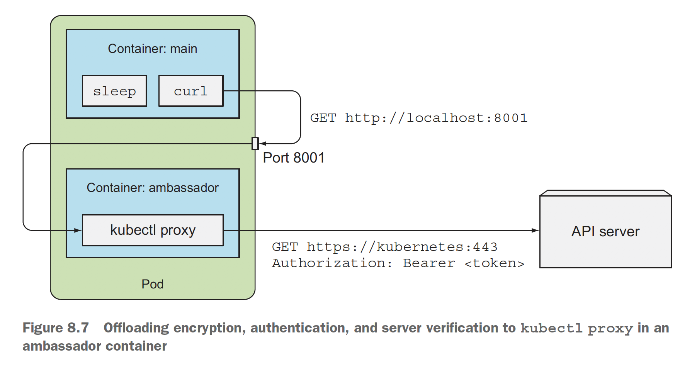

# 쿠버네티스 인 액션 8장: 애플리케이션에서 파드 메타데이터와 그 외의 리소스에 액세스하기
> Application => { Pod.Metadata , Other.Resource }

- 목차
컨테이너에 정보를 전달하기 위해 Downward API 사용
쿠버네티스 REST API 살펴보기
인증과 서버 검증을 kubectl proxy에 맡기기
컨테이너 내에서 API 서버에 접근하기
앰배서더 컨테이너 패턴의 이해
쿠버네티스 클라이언트 라이브러리 사용


## 8.1 Downward API로 메타데이터 전달
> ConfigMap, Secret Volume 등으로 설정 정보를 애플리케이션에 전달도 가능하지만, 이러한 정보들은 파드가 노드에 실행되기 이전에 이미 알고 있어야 하는 유형의 방식입니다. 즉, **파드의 IP, 호스트 혹은 노드 이름 등의 런타임 시에만 알 수 있는 데이터**는 어떻게 알아낼 수 있을까요? 정답은 Downward API 가 제공해줄 수 있습니다

* Downward API 는 "환경변수" 혹은 "파일 (Downward API volume)"을 이용하여 메타데이터를 노출합니다 

### 8.1.1 사용 가능한 메타데이터
* 환경 변수로 전달 가능한 "파드의 이름, IP, 네임스페이스, 노드 이름, 서비스 어카운트 이름"
* Downward API 볼륨을 통해서만 전달 가능한 "레이블, 어노테이션"
* 그리고 각 컨테이너의 CPU와 메모리 요청, 제한 정도를 메타데이터를 통해 확인이 가능합니다

### 8.1.2 환경변수로 메타데이터 노출하기
> **The kibibyte** was designed to replace the kilobyte in those computer science contexts in which the term kilobyte is used to mean 1024 bytes.
> The interpretation of kilobyte to denote 1024 bytes, conflicting with the SI definition of the prefix kilo (1000), used to be common.
> Kilobytes 를 1000 혹은 1024로 계산할 지에 대한 오해를 없애기 위해 5G = 5000000 KB, 5000 MB 를 말합니다. 그리고 5 Gi = 1024 * 1024 KB 정도의 단위는 ( 1024가 아니라 1000을 말합니다


* spec.containers.env 아래의 name 과 valueFrom.fieldRef.fieldPath 항목으로 지정합니다
* 클러스터를 기동하고 환경변수 사용을 실습합니다
  - [How to Set and List Environment Variables in Linux](https://linuxize.com/post/how-to-set-and-list-environment-variables-in-linux/)
```bash
bash> gcloud container clusters create kubia --num-nodes 3 --machine-type g1-small
bash> kubectl create -f downward-api-env.yaml
bash> kubectl exec downward pod -- env
bash> kubectl exec downward -- printenv HOSTNAME POD_IP
```

### 8.1.3 downwardAPI 볼륨에 파일로 메타데이터 전달

> Q1. 여기서 metadata 이름만 변경해서 환경변수 버전과 볼륨 버전을 동시에 띄우는 경우 실패했는데 원인을 알 수 없었다
A1. 3~5번 재시도 끝에 두 가지 버전이 기동되기는 했으나 왜 그런지 잘 모르겠다
```text
Error: failed to start container "second": Error response from daemon: OCI runtime create failed: container_linux.go:349: starting container process caused "process_linux.go:449: container init caused \"process_linux.go:415: setting cgroup config for procHooks process caused \\\"failed to write \\\\\\\"4194304\\\\\\\" to \\\\\\\"/sys/fs/cgroup/memory/kubepods/burstable/pod9fcdcea4-4937-4aff-860c-1498ca27624b/second/memory.limit_in_bytes\\\\\\\": write /sys/fs/cgroup/memory/kubepods/burstable/pod9fcdcea4-4937-4aff-860c-1498ca27624b/second/memory.limit_in_bytes: device or resource busy\\\"\"": unknown
```

* 순서대로 파드를 실행 및 실습합니다
  - 두 가지 동시에 실행 시에 문제가 있을 수 있으니 하나씩 기동합니다
```bash
bash> kubectl delete downward
bash> kubectl create -f downward-api-volume.yaml
bash> kubectl exec downward ls /etc/downward
bash> kubectl exec downward cat /etc/downward/labels
```
* 레이블과 어노테이션 업데이트
  - **환경변수**의 경우 런타임 시에 업데이트 할 수 없기 때문에 파드의 레이블 및 어노테이션이 환경변수로 노출된 경우 변경이 발생한 다음 새로운 값을 노출할 수 없다
  - 레이블과 어노테이션은 볼륨을 통해서만 노출하는 것이 좋다. 그렇다면 *프로그램 내에서 해당 환경변수를 별도로 캐시하는 것도 위험할 수 있을 것 같다*
  - 볼륨을 이용하는 경우 조금 복잡해지지만, 한 컨테이너의 리소스 필드를 다른 컨테이너에 전달할 수 있습니다. 단 같은 파드에 있어야만 합니다 (같은 노드가 아닙니다)

* 2개의 컨테이너를 띄우되 하나는 환경변수(first), 나머지 하나는 볼륨(second)를 이용합니다
  - 여전히 오류는 발생하나 다시 시도하여 성공합니다
```bash
Events:
  Type     Reason     Age                From               Message
  ----     ------     ----               ----               -------
  Normal   Scheduled  29s                default-scheduler  Successfully assigned default/downward-second to gke-kubia-default-pool-ed4a9fa3-20fl
  Normal   Pulling    28s                kubelet            Pulling image "busybox"
  Normal   Pulled     27s                kubelet            Successfully pulled image "busybox"
  Normal   Created    27s                kubelet            Created container first
  Normal   Started    27s                kubelet            Started container first
  Warning  Failed     24s (x2 over 26s)  kubelet            Error: failed to start container "second": Error response from daemon: OCI runtime create failed: container_linux.go:349: starting container process caused "process_linux.go:449: container init caused \"process_linux.go:415: setting cgroup config for procHooks process caused \\\"failed to write \\\\\\\"4194304\\\\\\\" to \\\\\\\"/sys/fs/cgroup/memory/kubepods/burstable/pod8d777044-9a7e-4aac-b8ee-e61681568cd7/second/memory.limit_in_bytes\\\\\\\": write /sys/fs/cgroup/memory/kubepods/burstable/pod8d777044-9a7e-4aac-b8ee-e61681568cd7/second/memory.limit_in_bytes: device or resource busy\\\"\"": unknown
  Normal   Pulling    13s (x3 over 27s)  kubelet            Pulling image "busybox"
  Normal   Pulled     12s (x3 over 26s)  kubelet            Successfully pulled image "busybox"
  Normal   Created    12s (x3 over 26s)  kubelet            Created container second
  Normal   Started    12s                kubelet            Started container second

psyoblade  ~/git/psyoblade/kubernetes-in-action/Chapter08   master  k get po
NAME              READY   STATUS    RESTARTS   AGE
downward-second   2/2     Running   2          32s

bash> kubectl exec downward-second -c first -- printenv CONTAINER_CPU_REQUEST_MILLICORES
30

bash> kubectl exec downward-second -c second -- cat /etc/downward/containerCpuRequestMilliCores
30
```

* Downward API 의 한계점
  - 손쉽게 사용할 수 있는 장점은 있으나 더 많은 정보를 이용하기 위해서는 쿠버네티스 API 를 이용해야만 합니다


## 8.2 쿠버네티스 API 서버와 통신하기
> 서비스와 파드에 관한 정보는 서비스 관련 환경변수나 DNS를 통해 얻을 수 있기 때문에, 클러스터에 정의된 *다른 파드*나 리소스에 관한 더 많은 정보가 필요한 경우가 있습니다
즉, 본 장에서는 프록시를 통해서 쿠버네티스 API 를 활용하여 *직접 현재 수행되고 있는 쿠버네티스의 상태 혹은 정보를 API Endpoint 호출을 통해 알아낼 수 있다*는 의미입니다


### 8.2.1 쿠버네티스 REST API 살펴보기
> https 인증 때문에 직접 접근은 어렵다. (curl --insecure https://34.64.225.247)

* kubectl 프록시로 API 서버 접근
  - 쿠버네티스가 제공하는 모든 APIs 목록을 확인할 수 있습니다
```bash
bash> kubectl proxy
Starting to serve on 127.0.0.1:8001

bash> curl localhost:8001
{
  "paths": [
    "/api",
    "/api/v1",
    "/apis",
    "/apis/",
    "/apis/admissionregistration.k8s.io",
    "/apis/admissionregistration.k8s.io/v1",
    "/apis/admissionregistration.k8s.io/v1beta1",
...
    "/apis/autoscaling/v2beta2",
    "/apis/batch",
    "/apis/batch/v1",
    "/apis/batch/v1beta1",
    "/apis/certificates.k8s.io",
...
}

bash> curl http://localhost:8001/apis/batch
{
  "kind": "APIGroup",
  "apiVersion": "v1",
  "name": "batch",
  "versions": [
    {
      "groupVersion": "batch/v1",
      "version": "v1"
    },
    {
      "groupVersion": "batch/v1beta1",
      "version": "v1beta1"
    }
  ],
  "preferredVersion": {
    "groupVersion": "batch/v1",
    "version": "v1"
  }
}
```

* batch 그룹의 v1 항목을 확인합니다
  - batch/v1 : 각 API 그룹에서 리소스 유형 및 REST 엔드포인트 목록을 반환합니다
  - batch/v1/jobs : 클러스터에 존재하는 모든 잡 인스턴스를 확인합니다
  - batch/v1/namespaces/default/jobs/<job-name> : 네임스페이스를 통한 특정 잡을 확인합니다
```bash
bash> curl http://localhost:8001/apis/batch/v1
{
  "kind": "APIResourceList",
  "apiVersion": "v1",
  "groupVersion": "batch/v1",
  "resources": [
    {
      "name": "jobs",
      "singularName": "",
      "namespaced": true,
      "kind": "Job",
      "verbs": [
        "create",
        "delete",
        "deletecollection",
        "get",
        "list",
        "patch",
        "update",
        "watch"
      ],
      "categories": [
        "all"
      ],
      "storageVersionHash": "mudhfqk/qZY="
    },
    {
      "name": "jobs/status",
      "singularName": "",
      "namespaced": true,
      "kind": "Job",
      "verbs": [
        "get",
        "patch",
        "update"
      ]
    }
  ]
}

bash> kubectl create -f my-job.yaml
bash> curl http://localhost:8001/apis/batch/v1/jobs
{
  "kind": "JobList",
  "apiVersion": "batch/v1",
  "metadata": {
    "selfLink": "/apis/batch/v1/namespaces/default/jobs/",
    "resourceVersion": "58696"
  },
  "items": [
    {
      "metadata": {
        "name": "my-job",
        "namespace": "default",
        "selfLink": "/apis/batch/v1/namespaces/default/jobs/my-job",
        "uid": "c52b1882-4fc4-4e4e-8369-67a6efbc7eac",
        "resourceVersion": "58532",
        "creationTimestamp": "2020-11-13T12:39:44Z",
        "labels": {
          "app": "batch-job",
          "controller-uid": "c52b1882-4fc4-4e4e-8369-67a6efbc7eac",
          "job-name": "my-job"
        }
      },
...

bash> kubectl get jobs -o json  # 과 동일한 결과
{
    "apiVersion": "v1",
    "items": [
        {
            "apiVersion": "batch/v1",
            "kind": "Job",
            "metadata": {
                "creationTimestamp": "2020-11-13T12:39:44Z",
                "labels": {
                    "app": "batch-job",
                    "controller-uid": "c52b1882-4fc4-4e4e-8369-67a6efbc7eac",
                    "job-name": "my-job"
                },
                "name": "my-job",
                "namespace": "default",
                "resourceVersion": "58532",
                "selfLink": "/apis/batch/v1/namespaces/default/jobs/my-job",
                "uid": "c52b1882-4fc4-4e4e-8369-67a6efbc7eac"
            },
...
```

### 8.2.2 파드 내에서 API 서버와 통신
> kubectl 이 없는 환경에서 쿠버네티스 API 와 통신하는 방법을 실습합니다

* 1. API 서버와 통신을 시도하기 위해 파드 실행
  - curl 만 존재하는 tutum/curl 을 띄워두고, sleep 상태이므로 bash 터미널을 열어둡니다
```bash
bash> kubectl create -f curl.yaml
bash> kubectl exec -it curl bash

$> env | grep KUBERNETES_SERVICE
KUBERNETES_SERVICE_PORT=443
KUBERNETES_SERVICE_HOST=10.87.240.1
KUBERNETES_SERVICE_PORT_HTTPS=443

bash> kubectl get svc
NAME         TYPE        CLUSTER-IP    EXTERNAL-IP   PORT(S)   AGE
kubernetes   ClusterIP   10.87.240.1   <none>        443/TCP   3h46m

$> curl -k https://kubernetes
```

* 2. 서버의 아이덴티티 검증
  - curl 을 --cacert 옵션을 이용하여 secret 에 저장된 파일을 이용한다
  - ~책과는 달리 Unauthorized 가 나오지 않고 "forbidden: User \"system:anonymous\" cannot get path 라고 나와서 실패~
  - -vvvv 옵션으로 보면 CA 및 TOKEN 모두 성공했으나 403 오류인 점으로 이상하였고, **https://kubernetes/api/v1 접근은 가능하다**
  - 단, 상세 리소스에 액세스할 때에는 동일한 403 오류가 나는 것으로 보아 문제점이 여전히 있다
```bash
#> ls /var/run/secrets/kubernetes.io/serviceaccount/
ca.crt	namespace  token

#> curl --cacert /var/run/secrets/kubernetes.io/serviceaccount/ca.crt https://kubernetes

#> export CURL_CA_BUNDLE=/var/run/secreets/kubernetes.io/serviceaccount/ca.crt
#> TOKEN=`cat /var/run/secrets/kubernetes.io/serviceaccount/token`
#> curl -H "Authorization: Bearer $TOKEN" https://kubernetes/api/v1 -vvvv
```

* 3. 역할 기반 액세스 제어(RBAC) 비활성화
  - 모든 서비스 어카운트(모든 파드)에 클러스터 관리자 권한이 부여되어 위험할 수 있으나 테스트 용도로만 사용하면 괜찮다
  - 이렇게 적용 후에는 노드에서 
```bash
bash> kubectl create clusterrolebinding permissive-binding --clusterrole=cluster-admin --group=system:serviceaccounts

#> export CURL_CA_BUNDLE=/var/run/secrets/kubernetes.io/serviceaccount/ca.crt
#> TOKEN=`cat /var/run/secrets/kubernetes.io/serviceaccount/token`
#> curl -H "Authorization: Bearer $TOKEN" https://kubernetes
{
  "paths": [
    "/api",
    "/api/v1",
    "/apis",
    "/apis/",
    "/apis/admissionregistration.k8s.io",
    "/apis/admissionregistration.k8s.io/v1",
    "/apis/admissionregistration.k8s.io/v1beta1",
...
```

* 4. 파드가 실행 중인 네임스페이스 얻기
  - 파드 목록을 가져올 때에 secret 파일에 포함된 정보를 이용해서 get pods 와 동일한 결과를 확인할 수 있습니다
```bash
#> NS=$(cat /var/run/secrets/kubernetes.io/serviceaccount/namespace)
#> curl -H "Authorization: Bearer $TOKEN" https://kubernetes/api/v1/namespaces/$NS/pods
{
  "kind": "PodList",
  "apiVersion": "v1",
  "metadata": {
    "selfLink": "/api/v1/namespaces/default/pods",
    "resourceVersion": "74531"
  },
  "items": [
    {
      "metadata": {
        "name": "curl",
        "namespace": "default",
        "selfLink": "/api/v1/namespaces/default/pods/curl",
        "uid": "f9aacf82-3d6f-44e1-8c8a-120b32dc8c8d",
        "resourceVersion": "59479",
        "creationTimestamp": "2020-11-13T12:43:02Z",
        "annotations": {
          "kubernetes.io/limit-ranger": "LimitRanger plugin set: cpu request for container main"
        }
      },
      "spec": {
...

#> curl -H "Authorization: Bearer $TOKEN" https://kubernetes/api/v1/namespaces/$NS/pods | grep kubia
  % Total    % Received % Xferd  Average Speed   Time    Time     Time  Current
                                 Dload  Upload   Total   Spent    Left  Speed
  0     0    0     0    0     0      0      0 --:--:-- --:--:-- --:--:--     0        "nodeName": "gke-kubia-default-pool-ed4a9fa3-20fl",
        "name": "kubia-rfwfd",
        "generateName": "kubia-",
        "selfLink": "/api/v1/namespaces/default/pods/kubia-rfwfd",
          "app": "kubia"
          "kubernetes.io/limit-ranger": "LimitRanger plugin set: cpu request for container kubia"
            "name": "kubia",
            "name": "kubia",
            "image": "luksa/kubia",
        "nodeName": "gke-kubia-default-pool-ed4a9fa3-xhj4",
            "name": "kubia",
            "image": "luksa/kubia:latest",
            "imageID": "docker-pullable://luksa/kubia@sha256:3f28e304dc0f63dc30f273a4202096f0fa0d08510bd2ee7e1032ce600616de24",
        "nodeName": "gke-kubia-default-pool-ed4a9fa3-20fl",
100 13073    0 13073    0     0   316k      0 --:--:-- --:--:-- --:--:--  327k
```

* 파드가 쿠버네티스와 통신하는 방법 정리
  - 파드가 생성될 시점에 *시크릿 볼륨*을 통해 공유된 namespace, token, ca.crt 파일을 이용하여 쿠버네티스 API 서버에 접근이 가능합니다
  - ca.cart : API 서버의 인증서가 인증 기관으로부터 서명 되었는지 검증을 위한 파일입니다
  - token : Authorization HTTP 헤더에 Bearer 토큰을 통해 자신을 인증하기 위한 파일입니다
  - namespace : 현재 파드의 네임스페이스를 알기 위한 파일입니다


* 앰배서더 컨테이너 패턴 소개
  - "컨테이너 앰배서더" 패턴이라는 것은 kubectl proxy 와 유사하게 "앰배서더"까지는 http 로 이후는 https 의 역할을 담당해 주는 것을 말합니다
  - *파드의 모든 컨테이너는 동일한 루프백 네트워크 인터페이스를 공유하므로 애플리케이션은 localhost 포트로 프록시에 액세스*할 수 있습니다


* 추가적인 앰배서더 컨테이너를 사용한 curl 파드 실행
  - main, ambassador 2개 컨테이너 실행 후, 동일하게 /api/v1 으로 접근해 봅니다 (/ 는 여전히 접근되지 않습니다)
  - 별도의 컨테이너가 사용되고 리소스가 소모되지만 복잡한 과정을 프록시로 처리해 준다는 장점이 있습니다
```bash
bash> k exec -it curl-with-ambassador -c main -- bash
#> curl http://localhost:8001/api/v1
```



### 8.2.4 클라이언트 라이브러리를 사용해 API 서버와 통신
* [Kubernetes Fabric8 Java Client](https://github.com/fabric8io/kubernetes-client) 이용한 방법
* [스웨거](http://swagger.io)와 OpenAPI 이용한 방법
  - 책에서의 옵션에 오류가 있으며 Enabled-SwaggerUI -> EnabledSwaggerUI 
```bash
bash> minikube start --extra-config=apiserver.Features.EnableSwaggerUI=true
```
