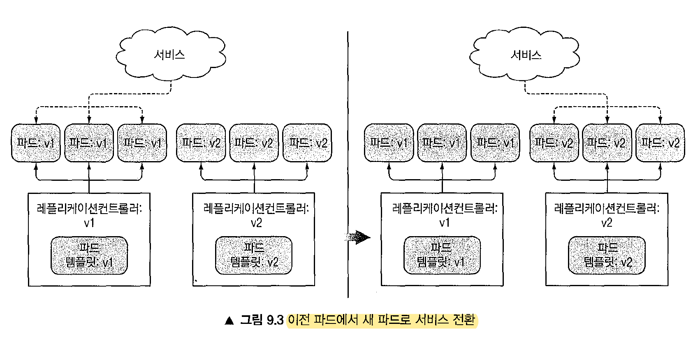
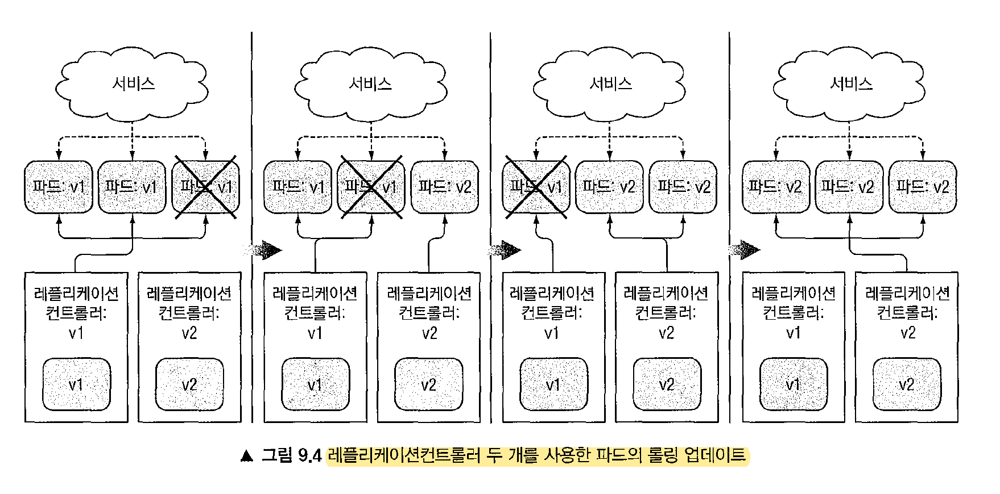
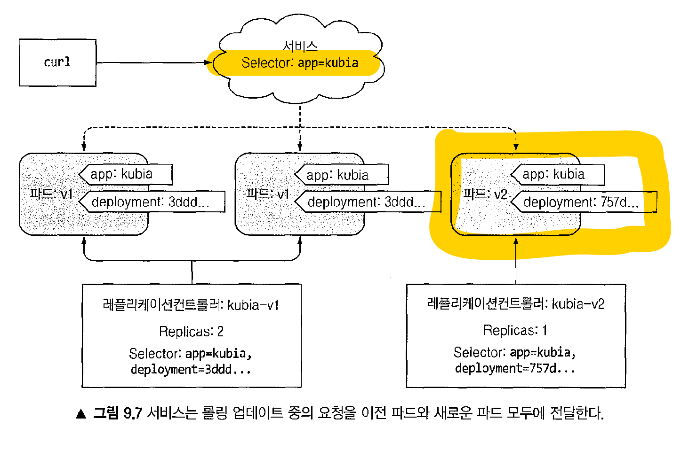
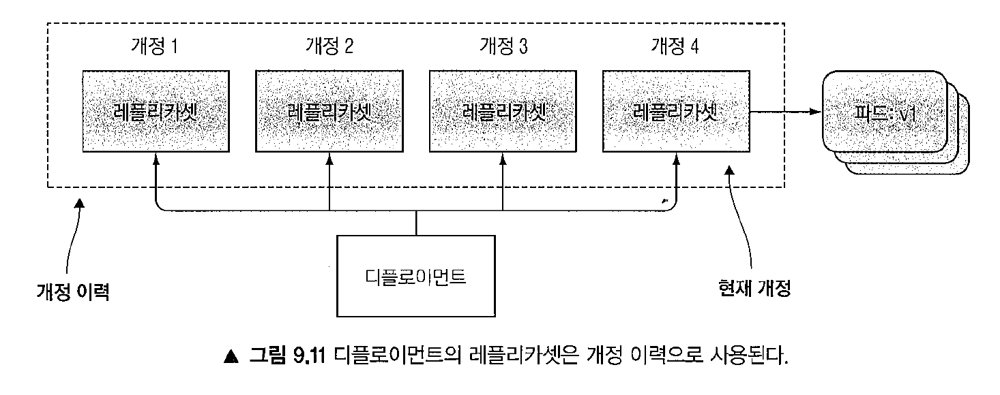
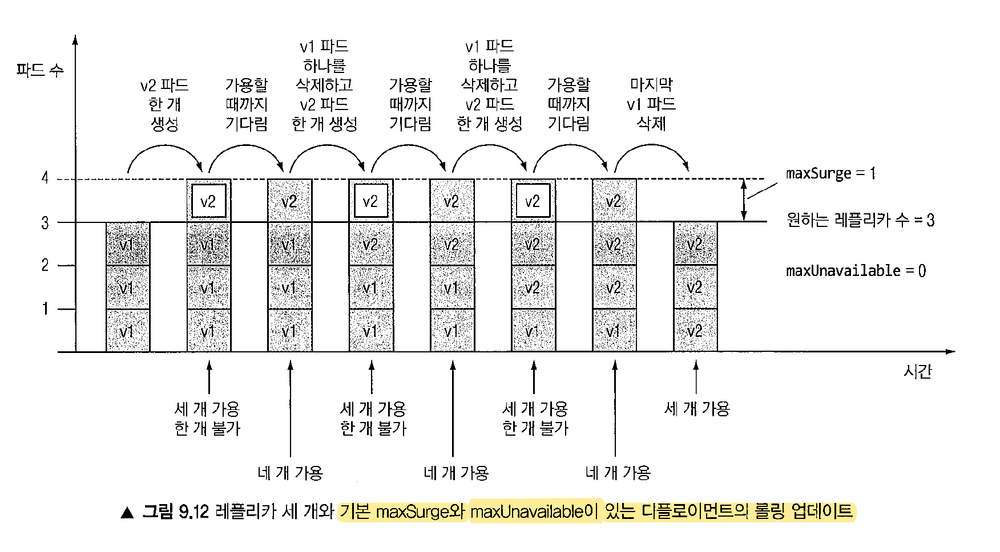
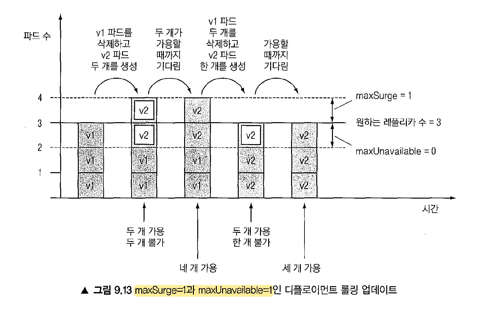
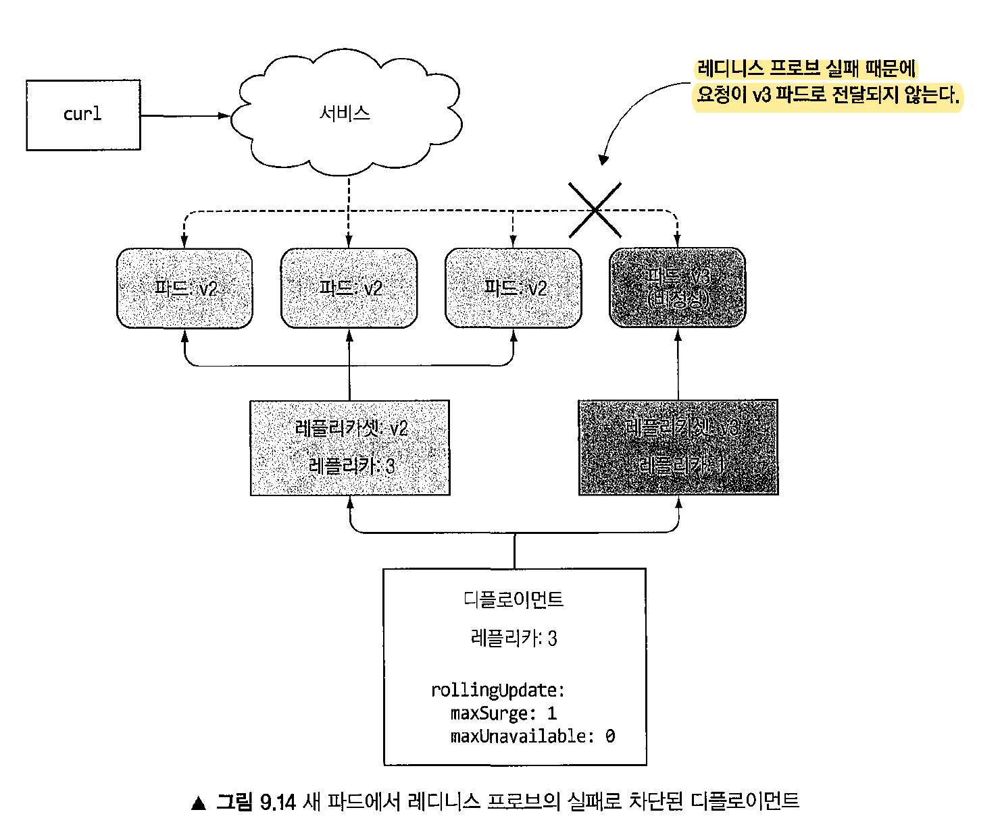

# 쿠버네티스 인 액션 9장 디플로이먼트: 선언적 애플리케이션 업데이트
> 

- 목차
  * [1. 파드를 최신 버전으로 교체](#1-파드를-최신-버전으로-교체)
  * [2. 관리되는 파드 업데이트](#2-관리되는-파드-업데이트)
  * [3. 디플로이먼트 리소스로 파드의 선언적 업데이트](#3-디플로이먼트-리소스로-파드의-선언적-업데이트)
  * [4. 롤링 업데이트 수행](#4-롤링-업데이트-수행)
  * [5. 이전 버전으로 파드 되돌리기](#5-이전-버전으로-파드-되돌리기)
  * [6. 롤아웃 속도 제어](#6-롤아웃-속도-제어)
  * [7. 잘못된 버전의 롤아웃 자동 차단](#7-잘못된-버전의-롤아웃-자동-차단)


## 0 초기 설정
> 자주 사용되는 명령어를 alias 를 적용해 둡니다
```bash
cat ~/.bashrc
export KUBE_EDITOR=/usr/bin/vim
alias kc=kubectl
alias getall="kubectl get svc,po,rc,rs,deployments"
alias getalls="while true ; do kubectl get svc,po,rc,rs,deployments; echo; sleep 1; done"
alias curls="while true; do curl localhost ; sleep 1 ; done"
```

## 1 파드를 최신 버전으로 교체
* ReplicationController 를 통한 서비스를 기동합니다.
  - 로컬 minikube 환경에서는 서비스 연동을 위해 터널링을 수행합니다
```bash
kubectl create -f kubia-rc-and-service-v1.yaml

bash> 
minikube tunnel
❗  The service kubia requires privileged ports to be exposed: [80]
🔑  sudo permission will be asked for it.
🏃  Starting tunnel for service kubia.
Password:

curl localhost:80
This is v1 running in pod kubia-v1-82k4s
```
* 기존 파드를 모두 삭제한 다음 새 파드를 시작합니다
  - 기존의 이미지의 v1 을 v2 로 변경합니다
  - 애플리케이션을 종료하고, v2 를 다시 기동합니다
  - 터널링도 다시 기동하고, localhost 에 액세스합니다
```bash
kubectl delete -f kubia-rc-and-service-v1.yaml

bash>
cat kubia-rc-and-service-v2.yaml
...
metadata:
  name: kubia-v2
spec:
  replicas: 3
  template:
    ...
    spec:
      containers:
      - image: luksa/kubia:v2
        name: nodejs
...

kubectl create -f kubia-rc-and-service-v2.yaml

bash>
minikube tunnel
curl localhost
This is v2 running in pod kubia-v2-26qkt
```
* 새로운 파드를 시작하고, 기동하면 기존 파드를 삭제한다.
  - 2개의 애플리케이션을 기동하기 위해서는 완전히 다른 ReplicationController 를 가져야 합니다.
  - 도중에 터널링 오류가 발생하는데 다시 재시작 해주면 v1 에서 v2 로 변경됩니다
  - 터널링 이슈 때문에 순차적으로 파드를 추가 제거하는 실습은 패스합니다
```bash
kubectl delete -f kubia-rc-and-service-v1.yaml
kubectl delete -f kubia-rc-and-service-v2.yaml

kubectl get rc
NAME       DESIRED   CURRENT   READY   AGE
kubia-v1   3         3         3       84s
kubia-v2   3         3         3       24s

kubectl get po
NAME             READY   STATUS    RESTARTS   AGE
kubia-v1-fv6kg   1/1     Running   0          107s
kubia-v1-kpsd6   1/1     Running   0          107s
kubia-v1-lqw6h   1/1     Running   0          107s
kubia-v2-bj8rz   1/1     Running   0          47s
kubia-v2-prl59   1/1     Running   0          47s
kubia-v2-vf8kw   1/1     Running   0          47s

bash>
E0903 23:42:09.155548   89047 ssh_tunnel.go:127] error stopping ssh tunnel: operation not permitted
❗  The service kubia-v2 requires privileged ports to be exposed: [80]
🔑  sudo permission will be asked for it.
🏃  Starting tunnel for service kubia-v2.

bash>
curl localhost
This is v1 running in pod kubia-v1-fv6kg

bash>
minikube tunnel

curl localhost
This is v2 running in pod kubia-v2-prl59
```


## 2 관리되는 파드 업데이트

### 9.1.1 오래된 파드를 삭제하고 새 파드로 교체
> v1 프로젝트를 생성하고, rc 파드 템플릿을 변경 후, 서비스의 파드를 삭제하는 방식으로 테스트 해보겠습니다

* 프로젝트 생성 후, ReplicationController 변경 후 일부 파드만 삭제하였을 때에 삭제된 파드가 생성시에 v2 로 생성되는지 확인합니다
  - edit rc 시에 KUBE\_EDITOR 설정이 제대로 되어 있지 않으면 수정내역이 반영되지 않으므로 주의바랍니다

```bash
kubectl create -f kubia-rc-and-service-v1.yaml

curl localhost
This is v1 running in pod kubia-v1-8jg95

kubectl get svc
NAME         TYPE           CLUSTER-IP     EXTERNAL-IP   PORT(S)        AGE
kubernetes   ClusterIP      10.96.0.1      <none>        443/TCP        40h
kubia        LoadBalancer   10.98.171.15   127.0.0.1     80:32128/TCP   63s

kubectl get po
NAME             READY   STATUS    RESTARTS   AGE
kubia-v1-8jg95   1/1     Running   0          68s
kubia-v1-b8wwx   1/1     Running   0          68s
kubia-v1-xdvht   1/1     Running   0          68s

kubectl get rc
NAME       DESIRED   CURRENT   READY   AGE
kubia-v1   3         3         3       71s

export KUBE_EDITOR=/usr/bin/vim
kubectl edit rc
...
spec:
  ...
  template:
    ...
    spec:
      containers:
      - image: luksa/kubia:v2
...

while true ; do curl localhost ; sleep 1 ; done
This is v1 running in pod kubia-v1-b8wwx
This is v2 running in pod kubia-v1-bljp7
This is v1 running in pod kubia-v1-xdvht
This is v2 running in pod kubia-v1-bljp7
This is v2 running in pod kubia-v1-bljp7
```

### 9.1.2 새 파드 기동과 이전 파드 삭제
> v1, v2 모두 기동한 상태에서 selector 변경을 통해 업데이트를 수행합니다 
* 2개의 프로젝트를 모두 기동합니다.
  - v1 프로젝트 생성 후, 터널링을 통해 접근을 확인합니다
  - 정상적으로 서비스가 기동되었다면 v2 도 기동합니다
  - 여전히 v1 프로젝트가 서비스되고 있으며, ReplicationControllverV1, PodsV1 은 그대로 유지하되 ServiceV1 만 ServiceV2 를 바라보도록 수정합니다
  - 프로젝트 확인 시에는 (svc -> po -> rc) 이용자가 접근하는 순서대로 체크합니다
  - "set selector" 명령을 통해서 v1 의 selector 를 변경 후, 정상적으로 모든 서비스가 v2 로 바뀌었는지 확인합니다

```bash
kubectl create -f kubia-rc-and-service-v1.yaml
minikube tunnel
curl localhost

kubectl create -f kubia-rc-and-service-v2.yaml

kubectl get svc
kubectl get po
kubectl get rc

kubectl set selector svc kubia app=kubia-v2
service/kubia selector updated

while true ; do curl localhost ; sleep 1 ; done
This is v2 running in pod kubia-v2-hdc84
This is v2 running in pod kubia-v2-gtjkk
This is v2 running in pod kubia-v2-gtjkk
This is v2 running in pod kubia-v2-6snkt
This is v2 running in pod kubia-v2-hdc84
This is v2 running in pod kubia-v2-hdc84
```


## 2 레플리케이션컨트롤러로 자동 롤링 업데이트 수행
> ReplicationController V1 -> V2 롤링 업데이트를 위해 v1 프로젝트를 통해 파드를 기동하고, 파라메터를 콤마 구분하여 get 명령어를 수행하면 3가지 오브젝트에 대한 결과를 다 얻을 수 있습니다

```bash
kubectl create -f kubia-rc-and-service-v1.yaml 
kubectl get svc,po,rc

NAME                 TYPE           CLUSTER-IP      EXTERNAL-IP   PORT(S)        AGE
service/kubernetes   ClusterIP      10.96.0.1       <none>        443/TCP        47h
service/kubia        LoadBalancer   10.105.67.161   <pending>     80:32687/TCP   1s

NAME                 READY   STATUS    RESTARTS   AGE
pod/kubia-v1-nnkq8   1/1     Running   0          1s
pod/kubia-v1-p2w68   1/1     Running   0          1s
pod/kubia-v1-srkwt   1/1     Running   0          1s

NAME                             DESIRED   CURRENT   READY   AGE
replicationcontroller/kubia-v1   3         3         3       1s
```

### 9.2.1 애플리케이션 초기 버전 실행
  - 서비스 되고 있는 3개의 레플리케이션 서비스가 정상화인지 확인합니다
```bash
while true; do curl localhost ; sleep 1 ; done
This is v2 running in pod kubia-v2-vf8kw
This is v2 running in pod kubia-v2-bj8rz
This is v2 running in pod kubia-v2-bj8rz
This is v2 running in pod kubia-v2-prl59
This is v2 running in pod kubia-v2-prl59

```
* 레플리케이션컨트롤러로 자동 롤링 업데이트 수행
  - 현재 v2 가 서비스 되고 있으므로 이 서비스를 v3 로 롤링업데이트 실습을 합니다
  - 최종 적으로 모든 서비스는 순차적으로 v3 로 전환되었습니다
  - 참고로 동일한 태그로 이미지를 업데이트 한 경우 이미 존재하는 컨테이너는 과거 캐시를 그대로 사용하고, 신규 컨테이너는 최신 버전을 받게 됩니다
  - 이러한 상황을 회피하기 위해서는 반드시 컨테이너의 imagePullPolycy 속성이 Always 로 설정되어야 합니다 (Default = IfNotPresent)
```bash
bash>
kubectl get svc
NAME         TYPE           CLUSTER-IP      EXTERNAL-IP   PORT(S)        AGE
kubernetes   ClusterIP      10.96.0.1       <none>        443/TCP        30h
kubia-v2     LoadBalancer   10.110.74.163   127.0.0.1     80:30961/TCP   5m43s

bash>
kubectl rolling-update kubia-v2 kubia-v3 --image=luksa/kubia:v3
Command "rolling-update" is deprecated, use "rollout" instead
Created kubia-v3
Scaling up kubia-v3 from 0 to 3, scaling down kubia-v2 from 3 to 0 (keep 3 pods available, don't exceed 4 pods)
Scaling kubia-v3 up to 1
Scaling kubia-v2 down to 2
Scaling kubia-v3 up to 2


kubectl get po
NAME             READY   STATUS    RESTARTS   AGE
kubia-v2-bj8rz   1/1     Running   0          9m19s
kubia-v2-prl59   1/1     Running   0          9m19s
kubia-v2-vf8kw   1/1     Running   0          9m19s
kubia-v3-cf5df   1/1     Running   0          18s

kubectl get rc
NAME       DESIRED   CURRENT   READY   AGE
kubia-v2   3         3         3       9m24s
kubia-v3   1         1         1       24s

kubectl get svc
NAME         TYPE           CLUSTER-IP      EXTERNAL-IP   PORT(S)        AGE
kubernetes   ClusterIP      10.96.0.1       <none>        443/TCP        30h
kubia-v2     LoadBalancer   10.110.74.163   127.0.0.1     80:30961/TCP   9m27s

kubectl get rc
NAME       DESIRED   CURRENT   READY   AGE
kubia-v2   1         1         1       11m
kubia-v3   3         3         3       2m26s

...
Scaling kubia-v2 down to 0
Update succeeded. Deleting kubia-v2
replicationcontroller/kubia-v3 rolling updated to "kubia-v3"

get rc
NAME       DESIRED   CURRENT   READY   AGE
kubia-v3   3         3         3       3m28s

bash>
minikube tunnel

while true ; do curl localhost ; sleep 1 ; done
This is v3 running in pod kubia-v3-rr6xc
This is v3 running in pod kubia-v3-ss6lz
This is v3 running in pod kubia-v3-rr6xc
This is v3 running in pod kubia-v3-cf5df
This is v3 running in pod kubia-v3-cf5df
```
* 롤링 업데이트가 완료된 이후의 커네이너 상태를 확인합니다
  - v2 의 ReplicationController 를 그대로 복사하고
  - 해당 파드 템플릿에서 이미지를 변경해 새로운 ReplicationController 를 생성합니다
```bash
bash>
kubectl describe rc kubia-v3

Name:         kubia-v3
Namespace:    default
Selector:     app=kubia-v2,deployment=c5ad0a0f056d2391b1c1ff35a4c11c9d
Labels:       app=kubia-v2
Annotations:  <none>
Replicas:     3 current / 3 desired
Pods Status:  3 Running / 0 Waiting / 0 Succeeded / 0 Failed
Pod Template:
  Labels:  app=kubia-v2
           deployment=c5ad0a0f056d2391b1c1ff35a4c11c9d
  Containers:
   nodejs:
    Image:        luksa/kubia:v3
    Port:         <none>
    Host Port:    <none>
    Environment:  <none>
    Mounts:       <none>
  Volumes:        <none>
Events:
  Type    Reason            Age    From                    Message
  ----    ------            ----   ----                    -------
  Normal  SuccessfulCreate  6m7s   replication-controller  Created pod: kubia-v3-cf5df
  Normal  SuccessfulCreate  5m1s   replication-controller  Created pod: kubia-v3-ss6lz
  Normal  SuccessfulCreate  3m55s  replication-controller  Created pod: kubia-v3-rr6xc
```
* 롤링 업데이트 시에 상세한 로그를 남길 수 있습니다
  - 앞에서 테스트 하지 못 했던 v1 -> v2 rolling-update 를 수행합니다
  - "--v 6" 가 가장 상세한 로깅을 남기는 옵션입니다
  - 1. kubia-v2 ReplicationController 가 존재하지 않음을 확인하고 ReplicationControllerV2 를 생성합니다
  - 2. PUT 을 통해 ReplicationController 및 Pods 정보를 변경합니다 { name: kubia-v2, select: deployment=d195789279911bdab8abc7936d329baa, image: kubia:v2 }
  - 3. 정책에 따라 kubia-v2 는 0 에서 3개로, kubia-v1 은 3개에서 0개로 롤링 업데이트를 시작합니다
  - 4. 라벨 "app=kubia,deployment=...9baa" 이 신규로 배포된 v2 이며 정상적으로 파드가 생성됨을 확인 및 스케일링 되었습니다
  - 5. 반복적으로 파드 별로 모든 작업이 완료된 이후에 ReplicationControllerV1 은 DELETE 되었습니다.

```bash
bash>
kubectl rolling-update kubia-v1 kubia-v2 --image=luksa/kubia:v2 --v 6

Command "rolling-update" is deprecated, use "rollout" instead
I0904 16:38:24.902671    5626 loader.go:375] Config loaded from file:  /Users/psyoblade/.kube/config
I0904 16:38:24.916974    5626 round_trippers.go:443] GET https://127.0.0.1:32772/api/v1/namespaces/default/replicationcontrollers/kubia-v1 200 OK in 10 milliseconds

# kubia-v2 ReplicationController 가 존재하지 않음을 확인하고 ReplicationControllerV2 를 생성합니다
I0904 16:38:24.922967    5626 round_trippers.go:443] GET https://127.0.0.1:32772/api/v1/namespaces/default/replicationcontrollers/kubia-v2 404 Not Found in 2 milliseconds
I0904 16:38:24.925749    5626 round_trippers.go:443] GET https://127.0.0.1:32772/api/v1/namespaces/default/replicationcontrollers/kubia-v1 200 OK in 2 milliseconds

# PUT 을 통해 ReplicationController 및 Pods 정보를 변경합니다 { name: kubia-v2, select: deployment=d195789279911bdab8abc7936d329baa, image: kubia:v2 }
I0904 16:38:24.931953    5626 round_trippers.go:443] PUT https://127.0.0.1:32772/api/v1/namespaces/default/replicationcontrollers/kubia-v1 200 OK in 5 milliseconds
I0904 16:38:24.935224    5626 round_trippers.go:443] GET https://127.0.0.1:32772/api/v1/namespaces/default/pods?labelSelector=app%3Dkubia 200 OK in 3 milliseconds
I0904 16:38:24.945638    5626 round_trippers.go:443] PUT https://127.0.0.1:32772/api/v1/namespaces/default/pods/kubia-v1-nnkq8 200 OK in 5 milliseconds
I0904 16:38:24.954727    5626 round_trippers.go:443] PUT https://127.0.0.1:32772/api/v1/namespaces/default/pods/kubia-v1-p2w68 200 OK in 6 milliseconds
I0904 16:38:24.962181    5626 round_trippers.go:443] PUT https://127.0.0.1:32772/api/v1/namespaces/default/pods/kubia-v1-srkwt 200 OK in 7 milliseconds
I0904 16:38:24.967367    5626 round_trippers.go:443] PUT https://127.0.0.1:32772/api/v1/namespaces/default/replicationcontrollers/kubia-v1 409 Conflict in 4 milliseconds
I0904 16:38:24.970012    5626 round_trippers.go:443] GET https://127.0.0.1:32772/api/v1/namespaces/default/replicationcontrollers/kubia-v1 200 OK in 2 milliseconds
I0904 16:38:25.109274    5626 request.go:538] Throttling request took 128.054547ms, request: PUT:https://127.0.0.1:32772/api/v1/namespaces/default/replicationcontrollers/kubia-v1
I0904 16:38:25.121709    5626 round_trippers.go:443] PUT https://127.0.0.1:32772/api/v1/namespaces/default/replicationcontrollers/kubia-v1 200 OK in 6 milliseconds
I0904 16:38:25.308979    5626 request.go:538] Throttling request took 187.084637ms, request: GET:https://127.0.0.1:32772/api/v1/namespaces/default/pods?labelSelector=app%3Dkubia%2Cdeployment%3Dc00640c14f4e6676fdb15642f50823f4-orig
I0904 16:38:25.312281    5626 round_trippers.go:443] GET https://127.0.0.1:32772/api/v1/namespaces/default/pods?labelSelector=app%3Dkubia%2Cdeployment%3Dc00640c14f4e6676fdb15642f50823f4-orig 200 OK in 3 milliseconds
I0904 16:38:25.506942    5626 request.go:538] Throttling request took 194.200468ms, request: GET:https://127.0.0.1:32772/api/v1/namespaces/default/replicationcontrollers/kubia-v2
I0904 16:38:25.510254    5626 round_trippers.go:443] GET https://127.0.0.1:32772/api/v1/namespaces/default/replicationcontrollers/kubia-v2 404 Not Found in 3 milliseconds
I0904 16:38:25.708187    5626 request.go:538] Throttling request took 197.788153ms, request: POST:https://127.0.0.1:32772/api/v1/namespaces/default/replicationcontrollers

# POST 를 통해 ReplicationControllerV2 를 생성합니다
I0904 16:38:25.715315    5626 round_trippers.go:443] POST https://127.0.0.1:32772/api/v1/namespaces/default/replicationcontrollers 201 Created in 7 milliseconds
Created kubia-v2

I0904 16:38:25.906127    5626 request.go:538] Throttling request took 190.661874ms, request: GET:https://127.0.0.1:32772/api/v1/namespaces/default/replicationcontrollers/kubia-v1
I0904 16:38:25.909733    5626 round_trippers.go:443] GET https://127.0.0.1:32772/api/v1/namespaces/default/replicationcontrollers/kubia-v1 200 OK in 3 milliseconds
I0904 16:38:26.106485    5626 request.go:538] Throttling request took 196.242392ms, request: PUT:https://127.0.0.1:32772/api/v1/namespaces/default/replicationcontrollers/kubia-v1
I0904 16:38:26.112027    5626 round_trippers.go:443] PUT https://127.0.0.1:32772/api/v1/namespaces/default/replicationcontrollers/kubia-v1 200 OK in 5 milliseconds

# 정책에 따라 kubia-v2 는 0 에서 3개로, kubia-v1 은 3개에서 0개로 롤링 업데이트를 시작합니다
Scaling up kubia-v2 from 0 to 3, scaling down kubia-v1 from 3 to 0 (keep 3 pods available, don't exceed 4 pods)
Scaling kubia-v2 up to 1

I0904 16:38:26.118571    5626 round_trippers.go:443] GET https://127.0.0.1:32772/api/v1/namespaces/default/replicationcontrollers/kubia-v2/scale 200 OK in 3 milliseconds
I0904 16:38:26.124522    5626 round_trippers.go:443] PUT https://127.0.0.1:32772/api/v1/namespaces/default/replicationcontrollers/kubia-v2/scale 200 OK in 4 milliseconds
I0904 16:38:26.127616    5626 round_trippers.go:443] GET https://127.0.0.1:32772/api/v1/namespaces/default/replicationcontrollers/kubia-v2/scale 200 OK in 2 milliseconds
I0904 16:38:29.133294    5626 round_trippers.go:443] GET https://127.0.0.1:32772/api/v1/namespaces/default/replicationcontrollers/kubia-v2/scale 200 OK in 4 milliseconds
I0904 16:38:29.137445    5626 round_trippers.go:443] GET https://127.0.0.1:32772/api/v1/namespaces/default/replicationcontrollers/kubia-v2 200 OK in 3 milliseconds
I0904 16:39:29.148894    5626 round_trippers.go:443] GET https://127.0.0.1:32772/api/v1/namespaces/default/pods?labelSelector=app%3Dkubia%2Cdeployment%3Dc00640c14f4e6676fdb15642f50823f4-orig 200 OK in 8 milliseconds

# 라벨 "app=kubia,deployment=...9baa" 이 신규로 배포된 v2 이며 정상적으로 파드가 생성됨을 확인 및 스케일링 되었습니다
I0904 16:39:29.154045    5626 round_trippers.go:443] GET https://127.0.0.1:32772/api/v1/namespaces/default/pods?labelSelector=app%3Dkubia%2Cdeployment%3Dd195789279911bdab8abc7936d329baa 200 OK in 4 milliseconds
Scaling kubia-v1 down to 2

I0904 16:39:29.157841    5626 round_trippers.go:443] GET https://127.0.0.1:32772/api/v1/namespaces/default/replicationcontrollers/kubia-v1/scale 200 OK in 2 milliseconds
I0904 16:39:29.163079    5626 round_trippers.go:443] PUT https://127.0.0.1:32772/api/v1/namespaces/default/replicationcontrollers/kubia-v1/scale 200 OK in 4 milliseconds
I0904 16:39:29.169344    5626 round_trippers.go:443] GET https://127.0.0.1:32772/api/v1/namespaces/default/replicationcontrollers/kubia-v1/scale 200 OK in 4 milliseconds
I0904 16:39:32.176412    5626 round_trippers.go:443] GET https://127.0.0.1:32772/api/v1/namespaces/default/replicationcontrollers/kubia-v1/scale 200 OK in 3 milliseconds
I0904 16:39:32.179807    5626 round_trippers.go:443] GET https://127.0.0.1:32772/api/v1/namespaces/default/replicationcontrollers/kubia-v1 200 OK in 2 milliseconds
Scaling kubia-v2 up to 2

I0904 16:39:32.184214    5626 round_trippers.go:443] GET https://127.0.0.1:32772/api/v1/namespaces/default/replicationcontrollers/kubia-v2/scale 200 OK in 3 milliseconds
I0904 16:39:32.190626    5626 round_trippers.go:443] PUT https://127.0.0.1:32772/api/v1/namespaces/default/replicationcontrollers/kubia-v2/scale 200 OK in 5 milliseconds
I0904 16:39:32.194039    5626 round_trippers.go:443] GET https://127.0.0.1:32772/api/v1/namespaces/default/replicationcontrollers/kubia-v2/scale 200 OK in 2 milliseconds
I0904 16:39:35.202637    5626 round_trippers.go:443] GET https://127.0.0.1:32772/api/v1/namespaces/default/replicationcontrollers/kubia-v2/scale 200 OK in 4 milliseconds
I0904 16:39:35.205835    5626 round_trippers.go:443] GET https://127.0.0.1:32772/api/v1/namespaces/default/replicationcontrollers/kubia-v2 200 OK in 3 milliseconds
I0904 16:40:35.212702    5626 round_trippers.go:443] GET https://127.0.0.1:32772/api/v1/namespaces/default/pods?labelSelector=app%3Dkubia%2Cdeployment%3Dc00640c14f4e6676fdb15642f50823f4-orig 200 OK in 4 milliseconds
I0904 16:40:35.215945    5626 round_trippers.go:443] GET https://127.0.0.1:32772/api/v1/namespaces/default/pods?labelSelector=app%3Dkubia%2Cdeployment%3Dd195789279911bdab8abc7936d329baa 200 OK in 2 milliseconds
Scaling kubia-v1 down to 1

I0904 16:40:35.220218    5626 round_trippers.go:443] GET https://127.0.0.1:32772/api/v1/namespaces/default/replicationcontrollers/kubia-v1/scale 200 OK in 3 milliseconds
I0904 16:40:35.225344    5626 round_trippers.go:443] PUT https://127.0.0.1:32772/api/v1/namespaces/default/replicationcontrollers/kubia-v1/scale 200 OK in 4 milliseconds
I0904 16:40:35.230945    5626 round_trippers.go:443] GET https://127.0.0.1:32772/api/v1/namespaces/default/replicationcontrollers/kubia-v1/scale 200 OK in 4 milliseconds
I0904 16:40:38.240926    5626 round_trippers.go:443] GET https://127.0.0.1:32772/api/v1/namespaces/default/replicationcontrollers/kubia-v1/scale 200 OK in 3 milliseconds
I0904 16:40:38.245370    5626 round_trippers.go:443] GET https://127.0.0.1:32772/api/v1/namespaces/default/replicationcontrollers/kubia-v1 200 OK in 4 milliseconds
Scaling kubia-v2 up to 3

I0904 16:40:38.250479    5626 round_trippers.go:443] GET https://127.0.0.1:32772/api/v1/namespaces/default/replicationcontrollers/kubia-v2/scale 200 OK in 4 milliseconds
I0904 16:40:38.257139    5626 round_trippers.go:443] PUT https://127.0.0.1:32772/api/v1/namespaces/default/replicationcontrollers/kubia-v2/scale 200 OK in 5 milliseconds
I0904 16:40:38.260458    5626 round_trippers.go:443] GET https://127.0.0.1:32772/api/v1/namespaces/default/replicationcontrollers/kubia-v2/scale 200 OK in 2 milliseconds
I0904 16:40:41.271523    5626 round_trippers.go:443] GET https://127.0.0.1:32772/api/v1/namespaces/default/replicationcontrollers/kubia-v2/scale 200 OK in 3 milliseconds
I0904 16:40:41.274107    5626 round_trippers.go:443] GET https://127.0.0.1:32772/api/v1/namespaces/default/replicationcontrollers/kubia-v2 200 OK in 2 milliseconds
I0904 16:41:41.279253    5626 round_trippers.go:443] GET https://127.0.0.1:32772/api/v1/namespaces/default/pods?labelSelector=app%3Dkubia%2Cdeployment%3Dc00640c14f4e6676fdb15642f50823f4-orig 200 OK in 3 milliseconds
I0904 16:41:41.282222    5626 round_trippers.go:443] GET https://127.0.0.1:32772/api/v1/namespaces/default/pods?labelSelector=app%3Dkubia%2Cdeployment%3Dd195789279911bdab8abc7936d329baa 200 OK in 2 milliseconds
Scaling kubia-v1 down to 0

I0904 16:41:41.286223    5626 round_trippers.go:443] GET https://127.0.0.1:32772/api/v1/namespaces/default/replicationcontrollers/kubia-v1/scale 200 OK in 2 milliseconds
I0904 16:41:41.291591    5626 round_trippers.go:443] PUT https://127.0.0.1:32772/api/v1/namespaces/default/replicationcontrollers/kubia-v1/scale 200 OK in 4 milliseconds
I0904 16:41:41.297075    5626 round_trippers.go:443] GET https://127.0.0.1:32772/api/v1/namespaces/default/replicationcontrollers/kubia-v1/scale 200 OK in 4 milliseconds
I0904 16:41:44.304982    5626 round_trippers.go:443] GET https://127.0.0.1:32772/api/v1/namespaces/default/replicationcontrollers/kubia-v1/scale 200 OK in 2 milliseconds
I0904 16:41:44.307366    5626 round_trippers.go:443] GET https://127.0.0.1:32772/api/v1/namespaces/default/replicationcontrollers/kubia-v1 200 OK in 2 milliseconds
I0904 16:41:44.309548    5626 round_trippers.go:443] GET https://127.0.0.1:32772/api/v1/namespaces/default/replicationcontrollers/kubia-v2 200 OK in 2 milliseconds
I0904 16:41:44.314271    5626 round_trippers.go:443] PUT https://127.0.0.1:32772/api/v1/namespaces/default/replicationcontrollers/kubia-v2 200 OK in 4 milliseconds
I0904 16:41:47.320413    5626 round_trippers.go:443] GET https://127.0.0.1:32772/api/v1/namespaces/default/replicationcontrollers/kubia-v2 200 OK in 5 milliseconds
I0904 16:41:47.323866    5626 round_trippers.go:443] GET https://127.0.0.1:32772/api/v1/namespaces/default/replicationcontrollers/kubia-v2 200 OK in 3 milliseconds
Update succeeded. Deleting kubia-v1

# 반복적으로 파드 별로 모든 작업이 완료된 이후에 ReplicationControllerV1 은 DELETE 되었습니다.
I0904 16:41:47.333508    5626 round_trippers.go:443] DELETE https://127.0.0.1:32772/api/v1/namespaces/default/replicationcontrollers/kubia-v1 200 OK in 9 milliseconds
I0904 16:41:47.348270    5626 round_trippers.go:443] GET https://127.0.0.1:32772/api/v1/namespaces/default/replicationcontrollers/kubia-v2 200 OK in 14 milliseconds
replicationcontroller/kubia-v2 rolling updated to "kubia-v2"
```
* 사전에 확인한 ReplicationController 정보
```bash
kubectl describe rc kubia

Name:         kubia-v1
Namespace:    default
Selector:     app=kubia
Labels:       app=kubia
Annotations:  <none>
Replicas:     3 current / 3 desired
Pods Status:  3 Running / 0 Waiting / 0 Succeeded / 0 Failed
Pod Template:
  Labels:  app=kubia
  Containers:
   nodejs:
    Image:        luksa/kubia:v1
    Port:         <none>
    Host Port:    <none>
    Environment:  <none>
    Mounts:       <none>
  Volumes:        <none>
Events:
  Type    Reason            Age   From                    Message
  ----    ------            ----  ----                    -------
  Normal  SuccessfulCreate  5m    replication-controller  Created pod: kubia-v1-srkwt
  Normal  SuccessfulCreate  5m    replication-controller  Created pod: kubia-v1-p2w68


kubectl describe rc kubia-v2
Name:         kubia-v2
Namespace:    default
Selector:     app=kubia,deployment=d195789279911bdab8abc7936d329baa
Labels:       app=kubia
Annotations:  <none>
Replicas:     3 current / 3 desired
Pods Status:  3 Running / 0 Waiting / 0 Succeeded / 0 Failed
Pod Template:
  Labels:  app=kubia
           deployment=d195789279911bdab8abc7936d329baa
  Containers:
   nodejs:
    Image:        luksa/kubia:v2
    Port:         <none>
    Host Port:    <none>
    Environment:  <none>
    Mounts:       <none>
  Volumes:        <none>
Events:
  Type    Reason            Age    From                    Message
  ----    ------            ----   ----                    -------
  Normal  SuccessfulCreate  5m3s   replication-controller  Created pod: kubia-v2-dtl4k
  Normal  SuccessfulCreate  3m57s  replication-controller  Created pod: kubia-v2-sjkfl
  Normal  SuccessfulCreate  2m51s  replication-controller  Created pod: kubia-v2-xxfhd
```
* ReplicationController 가 삭제되면 관리되는 파드도 같이 삭제됩니다
  - rolling-update 를 통해 생성되었기 때문에 yaml 을 통해 깔끔한 삭제가 어렵습니다
```bash
kubectl delete rc kubia-v3
kubectl get svc,po,rc
```

### 9.2.3 kubectl rolling-update 를 더 이상 사용하지 않는 이유
* 아래와 같은 몇 가지 이유에 따라 ReplicationController 를 통한 RollingUpdate 대신 Deployment 를 통한 RollingUpdate 를 추천합니다
  - 내가 명시적으로 정의하지 않은 임의의 labelSelector 가 생성되어 파드가 운영되는 점
  - 업데이트 도중에 네트워크 혹은 장애 시에 프로세스는 도중에 중단되는 문제가 발생할 수 있는 점
  - 이 모든 과정이 명시적인 imperative 명령을 통해 수행되는 것 또한 바람직하지 않은 방향이다 (선언적인 운영이 더 낫다)


## 3 디플로이먼트 리소스로 파드의 선언적 업데이트
### 9.3 애플리케이션을 선언적으로 업데이트하기 위한 디플로이먼트 사용하기
> ReplicationController 혹은 ReplicaSet 는 직접적인 명령 수행을 지원하는 lower-level 수준의 업데이트 리소스인 반면, Deployment 는 애플리케이션을 배포하고 선언적 declarative 한 업데이트를 지원하는 high-level 리소스인 셈이다
* Deployment 는 ReplicaSet 을 사용하므로, ReplicationController 는 더 이상 사용되지 않습니다
  - 결국 ReplicationController 혹은 ReplicaSet 역할을 추상화하기 위해 Deployment 가 도입되었습니다

### 9.3.1 디플로이먼트 생성
* 리소스 생성 시에는 반드시 "--record" 옵션을 추가하여 개정 이력을 기록하도록 하여 추후 디버깅에 유용할 수 있도록 합니다
  - 디플로이먼트 리소스의 상태를 확인하는 데에는 3가지(get, describe, rollout status)를 이용할 수 있습니다
  - 생성된 디플로이먼트의 이름에는 "Deployment + Pod Template" 의 해시값을 가집니다 (kubia-59d857b444)
  - 디플로이먼트는 직접 파드를 관리하지 않으며 ReplicaSet 을 통해 관리하도록 하는 관리자입니다
```bash
kubectl create -f kubia-deployment-v1.yaml --record
kubectl get deployment kubia
kubectl describe deployment kubia
kubectl rollout status deployment kubia

kubectl get po
NAME                 TYPE        CLUSTER-IP   EXTERNAL-IP   PORT(S)   AGE
service/kubernetes   ClusterIP   10.96.0.1    <none>        443/TCP   2d

NAME                         READY   STATUS    RESTARTS   AGE
pod/kubia-59d857b444-gzfm4   1/1     Running   0          4m33s
pod/kubia-59d857b444-qb5j6   1/1     Running   0          4m33s
pod/kubia-59d857b444-s4v4j   1/1     Running   0          4m33s
``` 
* 디플로이먼트에 의해 생성된 ReplicaSet 을 확인해봅니다
  - 디플로이먼트는 파드 템플릿의 각 버전 별로 하나씩 여러 개의 레플리카셋을 만들어 유일한 쌍을 유지하게 합니다
```bash
kubectl get replicasets
NAME               DESIRED   CURRENT   READY   AGE
kubia-59d857b444   3         3         3       7m16s
```


## 4 롤링 업데이트 수행
> Deployment 를 통한 우아한 롤링업데이트를 수행할 수 있습니다

### 9.3.2 디플로이먼트 업데이트
> 사용 가능한 디플로이먼트 전략은 2가지 (Default=RollingUpdate, Recreate) 이며, Recreate 는 기존의 모든 파드를 삭제 후 새로운 파드를 만듭니다. 반대로 RollingUpdate 는 두 가지 버전을 동시에 실행해도 문제가 없고, 서비스 다운타임이 크리티컬한 영향을 주는 경우에 선택하는 전략입니다
> 즉, 기존에는 파드 및 템플릿을 직접 수정하여 의도하지 않은 수정결과를 확인하는 것에 비해 추상화된 객체인 Deployment 에 각종 변경 사항을 할 수 있도록 제어권을 주고, 해당 Deployment 의 replica 및 image 정보들을 이용하여 전체 롤링업데이트를 수행하도록 합니다

* 데모 목적으로 롤링 업데이트 속도 느리게 하기
  - 기본 값은 0초이므로 즉시 수행되지만 예제에서는 10초로 변경 후 테스트 합니다
  - 여기서는 디플로이먼트 스펙을 변경하였고, 파드 템플릿은 변경되지 않았습니다
```bash
kubectl describe deployments kubia | grep -i minReadySeconds
MinReadySeconds:        0

kubectl patch deployment kubia -p '{"spec": {"minReadySeconds": 10}}'
```
* 롤링 업데이트를 위한 디플로이먼트 이미지 변경하기
  - 오브젝트 리소스 수정 작업은 아래의 표를 참고하시기 바랍니다

| Commands | Description | Conditions |
| - | - | - |
| kubectl edit | 편집기를 통해 여러 속성을 수정합니다 | - |
| kubectl patch | 개별 속성을 수정합니다 | - |
| kubectl apply | 전체 YAML/JSON 파일을 통해 오브젝트를 수정 혹은 생성(없는 경우)합니다. | 파일에는 리소스의 전체 정의가 필요하며, 기존 오브젝트가 존재해야 동작합니다  |
| kubectl replace | YAML/JSON 파일을 통해 오브젝트를 새 것으로 교체합니다. | 파일에는 리소스의 전체 정의가 필요하며, 기존 오브젝트가 존재해야 동작합니다  |
| kubectl set image | Pod, ReplicationController:Template, Deployment, DaemonSet, Job or ReplicaSet 에 포함된 컨테이너 이미지를 수정합니다 | - |

```bash
kubectl describe deployment kubia | vi -
...
Pod Template:
  Labels:  app=kubia
  Containers:
   nodejs:
    Image:        luksa/kubia:v1
...

kubectl set image deployment kubia nodejs=luksa/kubia:v2
```
* 정상적으로 롤링업데이트가 되는지 확인해 봅니다
  - 파드 전체가 자연스럽게 업데이트 된 것을 확인할 수 있습니다
```bash
kubectl get rs
NAME               DESIRED   CURRENT   READY   AGE
kubia-59d857b444   0         0         0       27m
kubia-7d5c456ffc   3         3         3       6m33s

kubectl get po
NAME                         READY   STATUS    RESTARTS   AGE
pod/kubia-7d5c456ffc-5q2ls   1/1     Running   0          4m26s
pod/kubia-7d5c456ffc-jrxfg   1/1     Running   0          4m4s
pod/kubia-7d5c456ffc-psrmf   1/1     Running   0          4m15s

kubectl describe po kubia-7d5c456ffc-5q2ls | grep -i image
    Image:          luksa/kubia:v2
    Image ID:       docker-pullable://luksa/kubia@sha256:216cdd252c24726012bd78d47c2538de2abe5d75ac5a8afddeed8b3833f9e88d
  Normal  Pulled     5m47s  kubelet, minikube  Container image "luksa/kubia:v2" already present on machine
```


## 5 이전 버전으로 파드 되돌리기
* 오류가 있는 버전을 롤백하기
  - 책에 명시한 버전은 서비스가 없기 때문에 테스트가 불가하여 kubia-deployment-and-service-v1.yaml 파일을 일부 수정해서 사용합니다

```bash
create -f kubia-deployment-and-service-v1.yaml --record

kubectl patch deployment kubia -p '{"spec": {"minReadySeconds": 10}}'
kubectl set image deployment kubia nodejs=luksa/kubia:v2

kebectl get rs
NAME               DESIRED   CURRENT   READY   AGE
kubia-59d857b444   0         0         0       28m
kubia-79b84b44f4   3         3         3       35s  <-- 신규로 추가
kubia-7d5c456ffc   0         0         0       8m6s <-- 삭제 되었고

kubectl set image deployment kubia nodejs=luksa/kubia:v3
deployment.apps/kubia image updated


kubectl rollout status deployment kubia
Waiting for deployment "kubia" rollout to finish: 2 out of 3 new replicas have been updated...
Waiting for deployment "kubia" rollout to finish: 2 out of 3 new replicas have been updated...
Waiting for deployment "kubia" rollout to finish: 2 out of 3 new replicas have been updated...
Waiting for deployment "kubia" rollout to finish: 1 old replicas are pending termination...
Waiting for deployment "kubia" rollout to finish: 1 old replicas are pending termination...
Waiting for deployment "kubia" rollout to finish: 1 old replicas are pending termination...
deployment "kubia" successfully rolled out

```
* 오류 가 있는 버전의 상태를 확인후 롤백합니다
```bash
while true; do curl localhost ; sleep 1 ; done
Some internal error has occurred! This is pod kubia-79b84b44f4-sglv2
Some internal error has occurred! This is pod kubia-79b84b44f4-l5kfq
Some internal error has occurred! This is pod kubia-79b84b44f4-sglv2
Some internal error has occurred! This is pod kubia-79b84b44f4-l5kfq

kubectl rollout undo deployment kubia
deployment.apps/kubia rolled back

while true; do curl localhost ; sleep 1 ; done
Some internal error has occurred! This is pod kubia-79b84b44f4-sglv2
Some internal error has occurred! This is pod kubia-79b84b44f4-sm2p6
Some internal error has occurred! This is pod kubia-79b84b44f4-sglv2
This is v2 running in pod kubia-7d5c456ffc-plxjs
Some internal error has occurred! This is pod kubia-79b84b44f4-sglv2
This is v2 running in pod kubia-7d5c456ffc-plxjs

# 책에서는 이력이 잘 나온다고 되어 있으나 실제로는 정상동작하지 않았습니다 - 이력이 3건 있지만 동일한 버전으로 보였습니다
kubectl rollout history deployment kubia
```
* 특정 디플로이먼트로 롤백
  - 추적되는 리비전 1번으로 다시 수정되었음을 확인할 수 있습니다
  - 개정 버전은 현재 버전 +2개 (Default:2) 만 유지되며 이전 레플리카셋은 자동 삭제됩니다
```bash
kubectl rollout undo deployment kubia --to-revision=1

while true; do curl localhost ; sleep 1 ; done
This is v1 running in pod kubia-59d857b444-k8ss4
This is v1 running in pod kubia-59d857b444-k8ss4
This is v1 running in pod kubia-59d857b444-k8ss4
This is v1 running in pod kubia-59d857b444-bdt8x
This is v1 running in pod kubia-59d857b444-bdt8x
```


## 6 롤아웃 속도 제어
### 9.3.4 롤아웃 속도 제어
> 롤아웃의 경우 새 파드가 생성되고 사용 가능해지면 이전 파드가 삭제되고 새 파드가 서비스됩니다. 이 경우에 어떤 전략을 통해서 얼마나 빠르게 혹은 천천히 롤아웃 되는 지를 테스트 합니다
* 롤링 업데이트 전략의 maxSurge 와 maxUnavailable 속성 소개
  - maxSurge : 최대 허용 가능한 파드의 수를 조정하는 값이며, Ratio(%) 혹은 수치(#)로 지정할 수 있습니다.
    - 예를 들어 replicas=4 인데, maxSurge=4 인 경우, 롤링 업데이트 시점에 새 버전 파드가 4개 생성될 수 있다는 의미이며, default 가 25% 이므로 1개가 추가로 생성될 수 있어서 1개의 파드만 새 버전으로 생성될 수 있다는 말이며, 백분율을 절대 숫자로 변환하면서 반올림되어 계산됩니다.
    - 필요한 파드의 수가 늘어나 빠른 파드 교체가 가능하지만 반면, 순간적으로 필요한 시스템 자원이 급증하는 부작용을 고려해야 합니다.
  - maxUnavailable : 롤링 업데이트 중 동시에 삭제할 수 있는 파드의 최대 개수를 의미합니다.
    - 예를 들어 replicas=8 인데, 25%라면 2개의 파드가 동시에 삭제될 수 있습니다.
     동시에 교체되는 파드의 수가 늘어나 롤링 업데이트 속도가 빨라지는 반면, 교체 시에 나머지 서비스 파드에 트래픽이 몰리는 상황이 발생하므로, 이러한 경우를 고려해 조정하는 것이 좋습니다.


> usableNumOfPods (사용 가능한 파드의 수) = NumOfReplicas (전체 레플리카 수) + NumberOfMaxSurge (maxSurge 수치)


> removableNumOfPods (삭제 가능한 파드의 수) = usableNumOfPods (사용 가능한 파드의 수) - NumberOfMaxUnavailable (maxUnavailable 수치)


### 9.3.5 롤아웃 프로세스 일시 중지
> v3 의 실패를 거울삼아 잘못된 바이너리가 일괄 배포되는 것을 피하기 위해 일부 노드만 배포하여 테스트하고, 나머지 배포는 일시 중지하면 좋을 것 같으므로 rollout pause 명령을 통해 테스트 합니다

* 롤아웃 일시정지
  - 시작 직후에 (몇 초 이내에, w/ minReadySeconds) 롤아웃을 일시 중지한다
  - minReadySeconds 값은 배포 속도 조정이 아니라, 오작동 버전 배포를 방지하는 것이 첫 번째 목적입니다
```bash
kubectl describe deployment kubia | grep -i seconds
MinReadySeconds:        10

kubectl set image deployment kubia nodejs=luksa/kubia:v4

# 약 10초 이후에 pause 합니다
kubectl rollout pause deployment kubia

# 현재 상태를 확인하면 정상적으로 중지된 것을 확인할 수 있습니다
kubectl get svc,po,rs

NAME                 TYPE           CLUSTER-IP      EXTERNAL-IP   PORT(S)        AGE
service/kubernetes   ClusterIP      10.96.0.1       <none>        443/TCP        2d4h
service/kubia        LoadBalancer   10.108.207.56   127.0.0.1     80:31097/TCP   3h38m

NAME                         READY   STATUS    RESTARTS   AGE
pod/kubia-586b45dbdc-sntqs   1/1     Running   0          90s
pod/kubia-59d857b444-bdt8x   1/1     Running   0          3h25m
pod/kubia-59d857b444-k8ss4   1/1     Running   0          3h26m
pod/kubia-59d857b444-zvpgs   1/1     Running   0          3h26m

NAME                               DESIRED   CURRENT   READY   AGE
replicaset.apps/kubia-586b45dbdc   1         1         1       90s
replicaset.apps/kubia-59d857b444   3         3         3       3h38m
replicaset.apps/kubia-79b84b44f4   0         0         0       3h33m
replicaset.apps/kubia-7d5c456ffc   0         0         0       3h35m


# v4 가 정상 동작함을 확인 합니다
while true ; do curl localhost ; sleep 1 ; done
This is v1 running in pod kubia-59d857b444-bdt8x
This is v1 running in pod kubia-59d857b444-bdt8x
This is v1 running in pod kubia-59d857b444-zvpgs
This is v1 running in pod kubia-59d857b444-k8ss4
This is v1 running in pod kubia-59d857b444-zvpgs
This is v1 running in pod kubia-59d857b444-k8ss4
This is v4 running in pod kubia-586b45dbdc-sntqs
This is v1 running in pod kubia-59d857b444-zvpgs

kubectl rollout resume deployment kubia
deployment.apps/kubia resumed
```


## 7 잘못된 버전의 롤아웃 자동 차단
> 다음 장에 다룰 롤아웃 속도 제어와 같은 맥락이며 Deployment 속성에 minReadySeconds 값을 통해 속도를 제어한다고 볼 수 있지만, 이 값은 오작동 버전의 배포를 방지하기 위한 목적이 더 크다고 합니다.
  - 즉, reaplicas=3 이라면 default maxSurge, maxUnavailable 25% 를 이용하면 1개씩 순차적으로 롤링업데이트가 될 것이므로 안전하다
> 위의 예제에서 v3 의 오작동 파드의 경우에도 모두 배포되어 정상이라고 떴던 부분이 이상하다고 생각되었는데 이는 ReadinessProbe 가 제대로 설정되어 있지 않았기 때문에 컨테이너와 파드가 항상 준비된 것으로 간주되었기 때문입니다.
* 잘못된 버전을 실행하고 롤아웃이 멈추는 것을 확인합니다
  - 책에서 제공하는 예제는 오류가 있어 일부 수정한 버전을 수행하고 정상 접근이 되는 것을 확인합니다
```bash
kubectl create -f kubia-deployment-v2.yaml
minikube tunnel
while true ; do curl localhost ; sleep 1 ; done
```
* 새 버전으로 레디니스 프로브를 포함한 버전을 apply 합니다
  - 현재 상태를 확인해보면 신규로 생성된 버전이 실행상태가 아닌 것을 확인할 수 있습니다
  - 이와 같이 정상적으로 올라오지 못 하는 파드가 서비스되지 않도록 ReadinessProbe 를 통해 롤아웃을 자동 차단할 수 있습니다
```bash
kubectl apply -f kubia-deployment-v3-with-readinesscheck.yaml --record
kubectl get svc,po,rc,rs,deployments
NAME                         READY   STATUS    RESTARTS   AGE
pod/kubia-7d5c456ffc-482kz   1/1     Running   0          15m
pod/kubia-7d5c456ffc-vl2kl   1/1     Running   0          13m
pod/kubia-7d5c456ffc-zl9k5   1/1     Running   0          13m
pod/kubia-7d6c89d47b-mgp8s   0/1     Running   0          13m
```
* 레디니스 프로브가 잘못된 버전으로 롤아웃되는 것을 방지하는 법
> 새 파드가 시작되자마자 레디니스 프로브가 매초마다 시작됩니다 (readinessProbe.periodSeconds: 1) v3 의 경우 5회 이후부터 500 코드를 반환하므로 레디니스 프로브가 이때 부터 실패하기 시작합니다



* 롤아웃의 상태를 확인합니다
  - minReadySeconds=10 이라는 말은 적어도 10초 동안은 ReadinessProbe 에 제대로 응답해야 한다는 말이 됩니다
  - maxUnavailable=0 이므로 항상 3개의 replicas 를 유지하므로 더욱 안전합니다
```bash
kubectl rollout status deployment kubia
error: deployment "kubia" exceeded its progress deadline
```
* 롤아웃 데드라인 설정
> 기본적으로 롤아웃이 10분 동안 진행되지 않으면 실패한 것으로 간주합니다. 
```bash
kubectl describe deployments kubia
Conditions:
  Type           Status  Reason
  ----           ------  ------
  Available      True    MinimumReplicasAvailable
  Progressing    False   ProgressDeadlineExceeded
```
* 잘못된 롤아웃 중지
  - undo 하지 않아도 progressDeadlineSeconds 이후에 롤아웃은 자동 중지됩니다
```bash
kubectl rollout undo deployment kubia

kubectl get po
NAME                     READY   STATUS        RESTARTS   AGE
kubia-7d5c456ffc-482kz   1/1     Running       0          32m
kubia-7d5c456ffc-vl2kl   1/1     Running       0          30m
kubia-7d5c456ffc-zl9k5   1/1     Running       0          30m
kubia-7d6c89d47b-mgp8s   0/1     Terminating   0          30m
```

